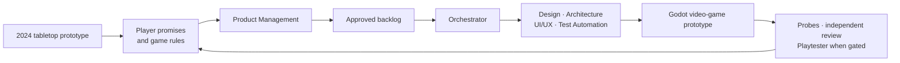
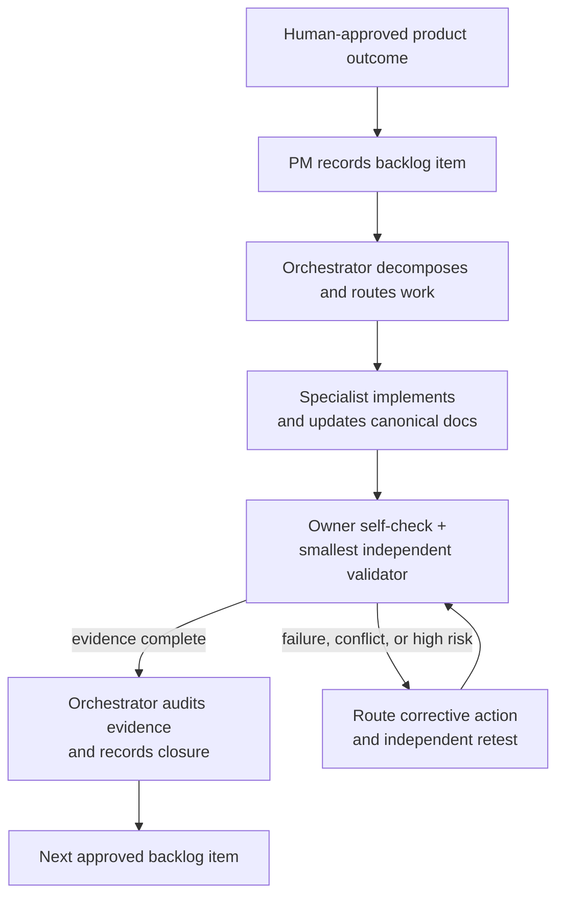

# Raid Card Tactics Prototype

A Godot 4 prototype for a cooperative fantasy raid-boss tactics game on a hex grid.

## Software Factory Experiment

This repository is both a game prototype and an experiment in an agent-assisted software factory.

The game began as a tabletop board-game prototype in 2024. The current work uses specialized Codex roles—Product Management, Orchestration, Game Design, Architecture, UI/UX, Test Automation, and on-demand Playtesting—to turn that physical design into a playable video game without losing the original player promises, rules intent, or playtest evidence.

The agents do not replace a single source of truth or product ownership. Product decisions begin with the human designer and PM; the repository keeps the durable rules, architecture decisions, backlog, handoff contracts, validation evidence, and coordination ledger. The Orchestrator sequences approved work across the specialist roles, while repeatable probes and independent reviews keep the game and its documentation aligned.

The operating model is intentionally part of the prototype: it is being tested alongside the game. See the [agent recovery kit](docs/agents/recovery-kit.md), [product backlog](.scratch/product-backlog/map.md), and [coordination ledger](docs/artifacts/project-coordination.md) for the current process and delivery state.





The current build centers on:

- A scripted boss timeline with `Boss Instant`, `Quick Window`, `Boss Incoming`, and `Slow Window`
- A persistent MMO-style action bar with chargeable slots
- A tank starter deck for the `Elian Voss`
- A small hex board with visible facing, board pieces, and paid movement
- Drag-first interactions for cards and board movement so the prototype can scale toward touch devices
- A portrait-first mobile HUD that keeps status, hand, board, persistent slots, and commands in one play surface
- WCAG-oriented 44 px minimum targets, 48 px command buttons, high-contrast states, and visible keyboard focus

## Core Docs

- [docs/README.md](docs/README.md): documentation map and promotion path for working notes
- [CONTEXT.md](CONTEXT.md): domain glossary and canonical language
- [docs/adr/0001-encounter-round-and-enrage.md](docs/adr/0001-encounter-round-and-enrage.md): why the encounter uses a scripted two-window round
- [docs/adr/0002-use-a-persistent-action-bar-with-charge-stacks.md](docs/adr/0002-use-a-persistent-action-bar-with-charge-stacks.md): why player actions use persistent slots and charge stacks
- [docs/rules/prototype-rules.md](docs/rules/prototype-rules.md): current playable rules of the prototype
- [docs/rules/mechanical-pillars-and-inspirations.md](docs/rules/mechanical-pillars-and-inspirations.md): the outside games that inform the design pillars and the boundaries on what not to copy
- [docs/artifacts/repo-artifacts.md](docs/artifacts/repo-artifacts.md): inventory of major gameplay artifacts in the repo
- [docs/artifacts/embermaw-vertical-slice.md](docs/artifacts/embermaw-vertical-slice.md): completed playable encounter, responsive layout, asset provenance, and verification
- [docs/artifacts/accessibility.md](docs/artifacts/accessibility.md): interaction-size, contrast, and keyboard-focus contract
- [docs/content/README.md](docs/content/README.md): authored content docs such as decklists, encounter specs, and boss scripts
- [docs/content/design-team-handoff.md](docs/content/design-team-handoff.md): designer Resource schemas, examples, validation, and playtest workflow

## Repository Layout

- [assets](assets): source art, audio, fonts, and UI media
- [resources](resources): Godot-ready gameplay resources, currently cards and boss actions
- [data](data): future machine-readable deck, encounter, and localization payloads
- [scenes](scenes): Godot scenes
- [scripts](scripts): runtime, UI, combat, and debug code
- [docs](docs): rules, decisions, authored content, and artifact catalog
- [notes](notes): research, playtest material, and screenshots

## Run

Open [project.godot](project.godot) in Godot 4.7+ and run the main scene.

The playable scene is [scenes/Main.tscn](scenes/Main.tscn).

## Current Interaction Model

- Drag cards from the hand into action bar slots to prepare, charge, or replace
- Activate slotted cards during their matching window
- Click a hex to target it for piece-targeting effects
- During the `Quick Window`, drag a hand card to an adjacent legal hex to discard it for `1 Stamina` and move; drag the Hero to preview legal routes
- Advance phases with the phase control to step through the boss timeline

## Main Code Paths

- [scripts/sdk/EncounterEngine.gd](scripts/sdk/EncounterEngine.gd): authoritative Encounter rules and state
- [scripts/Main.gd](scripts/Main.gd): direct-manipulation wiring that submits `EncounterAction` records
- [scripts/player/PlayerState.gd](scripts/player/PlayerState.gd): read-only player projection for existing UI
- [scripts/turns/TurnManager.gd](scripts/turns/TurnManager.gd): read-only phase projection
- [scripts/boss/BossState.gd](scripts/boss/BossState.gd): read-only Boss Timeline projection
- [scripts/cards/CardData.gd](scripts/cards/CardData.gd): reusable player card resource model
- [scripts/boss/BossActionData.gd](scripts/boss/BossActionData.gd): reusable boss action resource model
- [scripts/hex/HexGrid.gd](scripts/hex/HexGrid.gd): board, pieces, movement, and spawning

## Validate

```bash
scripts/debug/run_probes.sh          # POSIX / CI
```

```powershell
powershell -ExecutionPolicy Bypass -File ./scripts/debug/run_probes.ps1
```

Both adapters read `scripts/debug/probes.manifest` and require each Probe's declared success marker (ADR 0018).

## Prototype Scope Notes

This repo currently represents a playable vertical slice, not the final combat system.

Notable simplifications:

- Only one fully wired player role exists: the tank
- The boss script loops through a short authored action list
- Range, facing mechanics, and class-resource nuance are still early
- The one-player Embermaw encounter is complete; multiplayer roles, phase transformations, and deeper class resources remain future work
