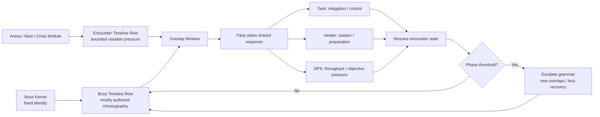
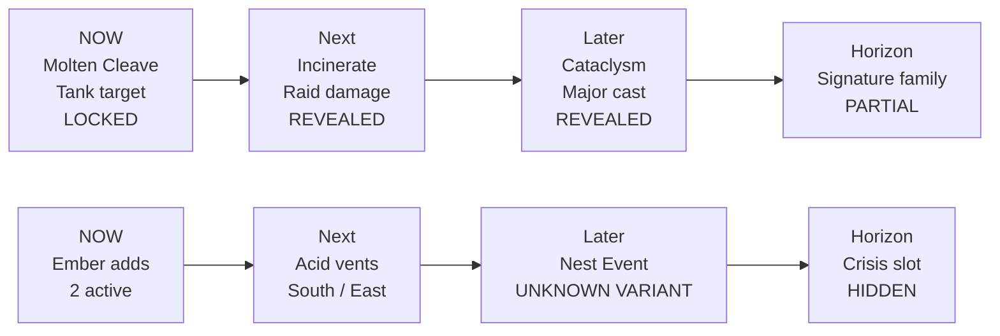

# Research: Cooperative Boss Design for a Repeatable Tactical Card Raid

Date: 2026-08-17 (revision 2, replacing the first report of the same date)
Provenance: external deep-research report supplied by the user, committed verbatim below the divider. This revision replaces the earlier version in place rather than sitting beside it, so the research canon has one current answer per question. Companion to the [encounter design bible](../../rules/encounter-design-bible.md) (D-020) and the [tank](2026-08-17-tank-solo-ceiling-design.md) and [healer](2026-08-17-healer-support-design-lessons.md) notes, which this revision cites directly.

Consumed by D-021 through D-027. Revision 2 keeps the substance those decisions rest on and adds material they do not yet cover — a content-source split of the Timeline rows, a graduated disclosure ladder, the Timeline as a zone cards can be played onto, transferable encounter responsibilities, cross-turn cooperation, and an Archive/Echo failure model. These additions are unratified until they appear in the decision log.

One thing did not carry forward: revision 1's eleven-metric repeatability table, which D-027 selected four metrics from. Those four and their two deferred siblings are written out in full in the [deck-evaluation rubric](../deck-evaluation-rubric.md), which is now their definition rather than this document.

---

# Cooperative Boss Design for a Repeatable Tactical Card Raid

## Executive Summary

The strongest answer from the research is that **no single reference should be copied wholesale**. The game you are describing wants a hybrid architecture:

> **Sentinels of the Multiverse for encounter modularity and villain identity; FFXIV for authored encounter choreography; WoW for signature mechanics and structural role pressure; Destiny for communication and transferable encounter responsibilities; Spirit Island for visible future-state planning; Aeon’s End for controlled escalation; and Bullets and Teeth and Aliens for cross-turn cooperation and variable “nest” pressure.**

That combination is unusually compatible with the Tank/Healer/DPS framework already emerging in your design research. Your tank paper's distinction that the Tank owns **mitigation** while the Healer owns **sustain**, and especially its argument that structural constraints endure better than numerical ones, maps closely to successful MMO encounter design. fileciteturn0file1 Your healer research's proposal that the visible Boss Timeline should become the healer's “home screen” is also strongly supported by how high-end MMO mechanics reward anticipation rather than merely recovering afterward. fileciteturn0file0 The League research's counterplay/clarity principles point in the same direction: powerful events become interesting when players can understand and meaningfully prepare for them. fileciteturn0file2

The most important finding about **Sentinels** is slightly counterintuitive: its secret is **not sophisticated boss telegraphing**. In the standard loop, the villain plays from its shuffled deck, then the heroes act, then the environment plays from another shuffled deck. The upcoming top villain card is generally unknown. Definitive Edition adds Advanced rules, Events, Critical Events, variants and expansions, but the fundamental architecture remains an authored villain deck intersecting with an independently authored environment deck and a variable hero team. citeturn3view1turn3view2turn3view3turn10search15

That distinction matters enormously for your game:

> **Sentinels should be your content topology, not your information topology.**

Take its modular composition—**Boss × Environment × Party × Variant**—but do not take its reliance on blind threat draws if you want the deliberate feeling of executing an MMO raid.

The best model I found for your **Timeline specifically is Spirit Island**, whose Invader system literally moves previously revealed threats through future states: what is explored now becomes a future build, and what is built becomes a future ravage. Players therefore fight *causes before they become consequences*. At the end of the Invader phase the cards physically advance from Explore → Build → Ravage, while later-stage cards and adversary escalation increase pressure. citeturn23search10turn21search1 That is remarkably close to what your Timeline wants to accomplish.

Meanwhile, **Aeon's End offers the best tabletop model for controlled boss randomness**. Its Nemesis deck is constructed from shuffled Tier I, II and III sections stacked in that order, so the exact threats are uncertain but the encounter has a guaranteed escalation curve; its variable turn-order deck adds tactical uncertainty separately. citeturn22search0turn22search4 This is preferable to simply shuffling all boss attacks together.

The MMO research reinforces that distinction between **macro certainty and micro uncertainty**. FFXIV lead battle content designer Masaki Nakagawa explicitly describes modern high-end encounters as favoring mechanics that ask players to make several decisions but give enough time for practiced players to learn and eventually execute them reliably. He also describes deliberate phase changes, loops, mechanic hints, damage-buff/mitigation timing and a balance between familiar and novel ideas. citeturn12view0 Current FFXIV Savage content still explicitly requires an eight-player composition built around two Tanks, a Pure Healer, a Barrier Healer and four DPS slots, while the current 2026 Ultimate, *Dancing Mad*, requires an eight-player party that has already cleared the corresponding Savage tier. citeturn11search0turn24search11

WoW's designers provide perhaps the clearest evidence for your “structural cooperation” idea. The Black Temple retrospective describes Illidan's second phase as simultaneously demanding enormous raid healing and precise tank positioning, with an elemental enraging if moved too far from its tether. The same retrospective describes the Illidari Council as deliberately splitting enemies to separate parts of the room, and the Reliquary of Souls was built around high-concept questions such as what happens when healers temporarily cannot perform their normal role. citeturn13search1 Blizzard has also explicitly argued that great encounters can support multiple valid approaches, even when players find strategies the designers did not anticipate. citeturn13search14

Destiny adds one critical dimension that conventional Tank/Healer/DPS MMOs underuse: **encounter roles need not equal character classes**. Deep Stone Crypt's Scanner, Operator and Suppressor functions are encounter-specific responsibilities; augment terminals allow players to switch roles during encounters. Bungie's designers explicitly say that hidden information and the communication of that information are tools used to strengthen coordination. They also describe the difficult design goal of making an encounter interesting during blind discovery but fast and satisfying once groups know the solution and are clearing it every week. citeturn20search0turn20search2 That is almost exactly your repeatability problem.

My strongest recommendation is therefore a **two-channel encounter architecture**:

**Top Timeline row — Boss Choreography.** Mostly authored, learnable, identity-defining mechanics. This is the FFXIV/MMO layer.

**Bottom Timeline row — Encounter Pressure.** Adds, hazards, environment events, nest mutations and crises drawn from constrained pools. This is the Sentinels environment / Aliens nest / Aeon's End procedural layer.

Their **overlap**, rather than either row alone, creates replayability.

A player should eventually learn, “After the second Molten Cleave, the dragon always prepares Cataclysm.” What they should *not* know perfectly is whether Cataclysm coincides this run with hatching adds, an unstable platform, a resource crisis, or relatively clear air.

That produces the ideal transition:

**First clear:** “What does this boss do?”  
**Fifth clear:** “We know the fight; let's execute it cleanly.”  
**Twentieth clear:** “We know the fight, but this particular overlap is asking us to adapt.”

That is a much stronger repeatability model than either pure scripting or pure random boss decks.

## Comparative Anatomy

One source clarification is necessary before comparing the Last Ditch titles. **The original *Bullets and Teeth* is not a cooperative boss game.** Its explicit objective is to be the final surviving player. The Bait draws a player card, adds a card from the Teeth deck to the Horde, attempts to neutralize the whole Horde, and then passes the Bait responsibility; non-Bait players are comparatively safe and can interfere. citeturn9view0 It is nevertheless relevant because designer Gavin Valentine's postmortem identifies the rotating Bait card, escalating Horde, suit-based action compression and variance-driven stories as deliberate solutions to pacing and complexity problems. citeturn1view0

The Last Ditch cooperative title is ***Bullets and Teeth and Aliens***. Last Ditch describes it as a 2–5-player cooperative game with Team-Up cards that let other players contribute during your turn, variable nests, boss bugs, crisis events and a shared defeat condition if any crewmember dies. citeturn25search0turn25search2 There is an odd status discrepancy as of August 2026: Last Ditch's site still labels the game “Coming Soon,” while GamesQuest recorded the project as fully dispatched in multiple regions by December 2, 2025. A public downloadable rules document did not surface in the research, so the analysis below intentionally distinguishes officially disclosed features from inferred implementation details. citeturn25search2turn19search1turn19search8

| System | Core boss/threat loop | Telegraphing / timeline | Escalation / enrage | Role interdependence | Randomness vs. scripting | Difficulty scaling | Replayability and player agency |
|---|---|---|---|---|---|---|---|
| **Sentinels of the Multiverse: Definitive Edition** | Villain acts first, heroes each take turns, then Environment acts; villain and environment largely automate themselves through decks. citeturn3view1 | **Low explicit future telegraphing.** Persistent villain cards and character rules expose ongoing consequences, but the next top-deck threat is normally unknown. citeturn3view1 | Villain flip states, accumulating permanents/minions and encounter-specific engines; Advanced rules and Events/Critical Events modify the challenge. citeturn3view2turn3view3 | Strong hero asymmetry and synergies, but no enforced Tank/Healer/DPS composition. | **Authored deck, randomized sequence.** Boss identity remains stable even though exact draws change. Separate Environment deck creates emergent cross-system combinations. citeturn3view1 | Advanced rules and Event/Critical Event structures change encounters rather than merely increasing HP. citeturn3view2turn3view3 | Extremely strong modularity: hero team × villain × environment × hero variants × villain events, with expansions adding complete new decks. Rook City Renegades alone adds six hero decks, nine villain decks and five environments. citeturn10search15 |
| **Bullets and Teeth** | The current **Bait** adds a Teeth card to the Horde and must stop all threatening Horde cards before combat; other players have a much smaller action allowance and can sabotage the Bait. citeturn9view0 | Horde already in play is completely visible; the next Teeth draw is not. | Horde gains cards over time; individual cards can accelerate growth—for example, Hoarder adds two further Teeth when revealed. citeturn9view0 | Competitive rather than cooperative, but the **rotating responsibility token** is an excellent mechanism to study. | Intentionally high variance. Designer notes explicitly describe variance as a way to generate player stories and let inexperienced players remain competitive. citeturn1view0 | Primarily social/player-count pressure rather than MMO-style difficulty modes. | Locations alter global conditions, Horde composition varies and the Bait changes hands. The designer describes the Bait system as the game's cornerstone and a way to add skill without bloating turn complexity. citeturn1view0 |
| **Bullets and Teeth and Aliens** | Cooperative party fights an unpredictable Horde while handling boss bugs, crises and corporate objectives. Team-Up cards explicitly allow cross-player action during another player's turn. citeturn25search0 | Public material says players must “plan ahead,” but detailed timing/telegraph rules are not publicly documented in the sources located. citeturn25search2 | Last Ditch promises pressure “from the first round to the last,” plus boss bugs and crises layered onto the Horde. citeturn25search0 | Strong shared-loss contract: one player's death defeats the whole team. Team-Up directly turns another player's turn into a cooperative window. citeturn25search0 | Horde is explicitly described as unpredictable; different **nests change every game**. citeturn25search0 | Supports 2–5 players; detailed scaling formula is not disclosed in the public material found. citeturn25search2 | Variable nests, equipment combinations, Team-Ups and multiple non-damage objectives provide the advertised replay structure. citeturn25search0 |
| **World of Warcraft raids** | Tank/heal/DPS combat is interrupted by encounter-specific spatial, add, movement and coordination mechanics; phases increasingly combine them. | Casts, visuals and learned timers telegraph immediate mechanics; veteran groups also learn the larger phase script. Black Temple's designers emphasize mechanically distinctive encounters rather than one universal pattern. citeturn13search1 | Phase transitions, rising overlap, resource pressure and hard/soft failure states. Illidan's tethered elementals could enrage when mishandled, making positional execution structurally decisive. citeturn13search1 | Very high. The same Illidan phase simultaneously stressed tank movement and raid healing. Five-player redesigns have historically required removing mechanics such as tank swaps because the party lacks the bodies/roles required. citeturn13search1turn13search5 | Strong authored structure with variable targets/positioning and substantial room for player-developed strategies. Blizzard explicitly notes that multiple different valid strategies can be a hallmark of a good encounter. citeturn13search14 | WoW deliberately separated flexible-size Normal/Heroic design from fixed-size high-end Mythic to permit tighter tuning; current raid releases continue to expose multiple formal difficulty tiers. citeturn24search0turn24search7 | Repetition shifts toward execution, optimization and alternate strategies. Blizzard's retrospective says encounter designers explicitly wanted memorable “remember when…” stories years later. citeturn13search1 |
| **Final Fantasy XIV Savage / Ultimate** | Highly authored combat puzzle: execute role assignments and mechanics while maintaining damage, healing and mitigation rotations. Modern Savage uses a defined eight-player role composition. citeturn11search0 | **Very high effective predictability after learning.** Nakagawa describes modern high-end design as favoring several decisions with enough reaction time that practice yields reliable solutions, plus deliberate hints, phase changes and loops. citeturn12view0 | Increasingly difficult phases and combinations culminate in strict late-fight execution; Ultimate sits beyond Savage in the progression ladder. Current *Dancing Mad (Ultimate)* requires the corresponding Savage clear. citeturn24search11 | Extremely explicit: current Savage requires two Tanks, a Pure Healer, Barrier Healer and four specified DPS categories. citeturn11search0 | Macro choreography is strongly authored; uncertainty is more useful when applied to assignments, permutations and reading mechanics than to wholly random ability selection. Nakagawa says designers balance novel mechanics with familiar ones. citeturn12view0 | Normal/Savage variants are developed and repeatedly tested together; Ultimate provides an additional pinnacle layer. Nakagawa says Normal and Savage are adjusted in tandem over repeated testing. citeturn12view0 | Repeatability comes primarily from **mastery of execution** rather than procedural generation: learning, consistency, damage optimization and mitigation planning. |
| **Destiny raids — Deep Stone Crypt model** | Firefight + spatial puzzle + communication + damage windows. Encounter-specific roles recur and evolve across the raid. citeturn20search0 | Telegraphing often comes from **distributed information**: different players can access information others need, so communication itself becomes a mechanic. citeturn20search0turn20search2 | Encounters layer previously learned concepts; Suppressor joins Scanner and Operator later, and the final fight becomes a culmination of the raid's learned mechanical language. citeturn20search0turn20search2 | Encounter roles are load-bearing but **transferable**, with terminals explicitly allowing players to switch roles. citeturn20search0 | Authored puzzle grammar with uncertainty in execution rather than an uncontrolled ability deck. | Bungie's newer raid framework has also experimented with selectable feats/modifiers that increase challenge and rewards, including Contest-like difficulty. citeturn24search4 | Bungie's designers explicitly discuss balancing the excitement of blind discovery against making a solved encounter quick and enjoyable for repeat weekly clears. citeturn20search2 |

Two additional tabletop systems fill gaps that none of those references solves alone.

**Spirit Island is the strongest model for a Timeline that itself creates gameplay.** The Invader Board shows previously revealed future actions and advances them every round. Explore creates a problem; next round that location Builds; afterward it Ravages. Players are therefore not simply reacting to an attack card—they manipulate the board *between announcement and consequence*. citeturn23search10turn23search0 Its expansions deliberately add Events when designers want uncertainty: the Jagged Earth rules explain that Events help prevent advanced players from being completely certain of victory many turns ahead, while acknowledging that some players prefer the base game's high predictability. citeturn21search15 That is almost a direct statement of your randomness-tuning problem.

**Aeon's End shows how to randomize without destroying pacing.** Each Nemesis contributes bespoke cards, but those cards are mixed into separately shuffled Tier I/II/III pools and then stacked in escalation order. Thus the designer controls *when categories of severity can appear* without controlling the exact card. The variable turn-order system then provides a different kind of uncertainty—who acts next—while the game's player decks themselves are deliberately never shuffled. citeturn22search0turn22search4

Those examples expose three fundamentally different kinds of replayability:

| Replay model | What the player learns | What changes on replay | Primary strength | Primary danger |
|---|---|---|---|---|
| **Sentinels model** | What each villain/environment card *can* do | Order and combinations | Emergent stories | Swingy draws can occasionally dominate decision quality. |
| **FFXIV model** | The encounter's choreography | Mostly player execution | Deep mastery and satisfying consistency | Eventually becomes rote if execution ceiling is exhausted. |
| **Destiny model** | The encounter's communication puzzle | Assignments and who performs responsibilities | Social coordination | Puzzle loses discovery value after solution is known. |
| **Spirit Island model** | Consequence pipeline | Locations and event interference | Extremely strong proactive agency | Too much visibility can allow deterministic calculation. |
| **Aeon's End model** | Threat categories and escalation curve | Exact threats inside controlled tiers | Reliable dramatic arc with uncertainty | Poorly constructed tier pools can feel mechanically repetitive. |

Your game can—and probably should—combine all five.

## Encounter Architecture and Repeatability

The core design problem is not “random versus scripted.” That framing is too crude.

The better question is:

> **Which parts must remain stable so the boss develops identity and mastery, and which parts may vary without breaking counterplay?**

FFXIV's developers explicitly distinguish mechanics that demand raw reaction speed from mechanics that ask players to make several decisions with adequate thinking time, favoring the latter in modern high-end design because practice produces a visible sense of progress. They also deliberately alternate safer/familiar encounter ideas with riskier novel ones rather than making every fight maximally experimental. citeturn12view0 WoW's Black Temple retrospective similarly emphasizes that a memorable boss needs a distinctive conceptual component, with encounters emerging from ideas such as a stationary boss, healer inversion or a council split across the room. citeturn13search1

This points to an **encounter kernel**.

Every boss should have perhaps three to five invariants which remain recognizable across essentially every run:

**Signature threat.** “This is the boss that consumes the arena.”  
**Signature responsibility.** “This is the fight where the Tank has to move the boss between anchors.”  
**Signature party interaction.** “This is the fight where damage players break seals to make the healer's next recovery window survivable.”  
**Signature escalation.** “Every completed cycle permanently removes safe space.”  
**Signature climax.** “The final phase recombines everything.”

Those should not be randomized away.

Then introduce bounded variation *around* the kernel.

A useful content formula is:

`Encounter = Boss Kernel + Phase Grammar + Encounter Module + Environment + Difficulty Mutators + Assignment Seed`

This is where Sentinels is so powerful. Its villain does not need to contain the entire scenario because an independent Environment deck contributes another authored system. Definitive Edition then layers Events, Critical Events and variants over that basic matrix. citeturn3view3turn10search15

For your two-row Timeline, that suggests an exceptionally clean division:



The **top row** establishes the boss's personality. The dragon still breathes fire. The golem still smashes the active platform. The lich still marks somebody for execution.

The **bottom row** changes the circumstances under which that known problem occurs. This run there are eggs hatching. Next run a collapsing platform forces the party to reposition. Another run the environment is temporarily benign, but a crisis card taxes party resources.

This directly combines the most valuable pieces of Sentinels and *Bullets and Teeth and Aliens*. Last Ditch explicitly advertises different nests that change every game and asks players to handle crises and boss bugs in addition to simply killing the horde. citeturn25search0 Sentinels independently mixes a villain with a separate environment. citeturn3view1

The boss therefore remains **learnable**, while the encounter remains **alive**.

A proposed timeline might look like this:



That also resolves a potential problem with a fully visible MMO timeline: **perfect foreknowledge is not automatically good counterplay**. If every target, number and environmental overlap is visible five turns ahead, optimal play may become calculation rather than tactical adaptation. Spirit Island's own expansion rules essentially acknowledge this tradeoff by saying Events add uncertainty that prevents experts from being completely confident about future victory. citeturn21search15

The solution is **graduated certainty**.

At long range, reveal the mechanic *family*: “large raid damage.” At medium range, reveal the exact ability and relevant board region. At short range, lock the targets and final magnitude. Occasionally allow heroes to spend resources to reveal information earlier.

That turns information into a resource without resorting to cheap surprise attacks.

### Why Sentinels stays fresh

Sentinels's most important replayability characteristic is **orthogonality**. Hero, Villain and Environment are separate content units rather than one monolithic scenario. Definitive Edition's expansion structure preserves that: Rook City Renegades adds complete new Hero, Villain and Environment decks plus Events and Critical Events, creating combinations with both old and new content. citeturn10search15

The boss does not merely get “+20% HP” on the next difficulty. Advanced rules and Events can alter how it operates. citeturn3view2turn3view3 Community statistical work on older Sentinels content also demonstrates that villain, variant and environment combinations produce materially different effective challenge levels rather than every matchup collapsing to a single universal difficulty rating. citeturn10search10

For your game, that implies that **replayable content should be produced by multiplying authored modules**, not by asking one procedural generator to invent bosses.

A relatively small content set can explode combinatorially:

`8 Bosses × 6 Arenas × 3 Boss Variants × 6 Raid Mutators = 864 encounter configurations`

You obviously would not expect all 864 to be equally good. The important point is that a reusable encounter module can transform many bosses.

That is much more economical than writing 864 independent fights, but considerably more controlled than generating 864 random scripts.

### Repeat play should become a different game

Destiny's Deep Stone Crypt postmortem states the problem almost perfectly: Bungie wants players to struggle and discover the solution during their first attempts, yet it also wants executing a known strategy to remain fast and enjoyable during weekly repeat clears. citeturn20search2

That suggests three explicit mastery stages for your card raid:

| Stage | Player question | What produces enjoyment |
|---|---|---|
| **Discovery** | “What does this thing mean?” | Reading, experimentation, communication, surprise. |
| **Execution** | “Can we perform the solution reliably?” | Timing, sequencing, resource discipline, role mastery. |
| **Optimization** | “Can we handle this variant more efficiently?” | Greed, adaptation, team composition, damage optimization, alternate solutions. |

The third stage is what prevents a solved fight from becoming dead content.

MMOs frequently sustain the second stage through mechanical execution and social coordination. A tactical card game can go further because its encounter deck is cheap to remix. **Once mastery removes informational uncertainty, the game can substitute compositional uncertainty.**

The boss does not need to forget its moves.

The *situation* changes around those moves.

## Distilled Design Patterns

The research yields several patterns that are directly applicable to the card raid.

**Authored grammar, randomized sentences.** The strongest compromise between FFXIV and Sentinels is to create a small vocabulary of signature mechanics and then vary legal combinations. Aeon's End demonstrates the tabletop version by randomizing cards *inside predetermined escalation tiers* rather than randomizing the entire progression. citeturn22search0 A boss phase might therefore have eight legal ability cards but select four per run according to constraints such as “exactly one movement test,” “at least one tank threat” and “signature mechanic always occupies slot four.”

The result should feel like fighting the same boss speaking slightly different sentences—not fighting a slot machine wearing the boss's artwork.

**Randomize assignments more aggressively than rules.** FFXIV's broader authored philosophy suggests why this works: a mechanic can remain learnable while forcing several contextual decisions. citeturn12view0 “Four players must occupy these positions” stays recognizable even when *which* positions activate or *which* players receive secondary debuffs changes.

In card-game terms, the player should recognize the **question** even when the correct answer changes.

**Create escalation through demand density before raw damage inflation.** This aligns directly with your tank research. fileciteturn0file1 Early in a fight, one mechanic asks for the Tank's mitigation. Later, that same mechanic occurs while adds require DPS attention. Later still, both happen while the healer is preparing a raid-wide burst.

The player experiences:

`one problem → overlapping problems → coupled problems`

rather than merely:

`10 damage → 15 damage → 25 damage`

WoW's Illidan example is precisely memorable because the difficulty came from heavy healing **and** careful tank movement around tethers and lethal beams, not simply a larger health pool. citeturn13search1

**Roles should have responsibility ownership, not permission keys.** Current FFXIV high-end matchmaking very explicitly creates Tank/Healer/DPS composition requirements. citeturn11search0 But translating that literally into “only a Healer card can remove the green Healer debuff” would be the weakest possible version of role design.

Prefer:

> Tank solves this problem **cheaply and repeatably**.  
> Another character can solve it **expensively or temporarily**.  
> Ignoring it forces the rest of the party to absorb the consequence.

That retains the fantasy of roles while allowing heroic recovery and clever edge cases.

Your earlier structural principle remains the cleanest formulation:

> **No stat total occupies two hexes.** fileciteturn0file1

A card saying “Tank Only” is a rule. Two simultaneous objectives in opposite locations are a world state.

The latter generates cooperation.

**Give players transferable encounter responsibilities in addition to permanent combat roles.** Destiny's Deep Stone Crypt is particularly valuable here. Scanner, Operator and Suppressor are not character classes; they are duties that the encounter gives players, and they can be passed through augment terminals. citeturn20search0

Your Tank should still be the Tank, but an encounter could also create a **Relic Bearer**, **Rune Reader**, **Anchor**, **Marked Champion** or **Conduit** responsibility.

This solves two problems simultaneously. It changes a player's job from boss to boss without destroying class identity, and it gives repeated clears social variation: “I'll handle the Relic this time.”

**Use rotating pressure to make every player's moment matter.** The original Bullets and Teeth's Bait mechanic is valuable despite that game's competitive structure. The designer calls it the cornerstone of the game: the Bait gets a very different action allowance and bears the Horde's immediate danger, while the Bait role moves between players. citeturn1view0turn9view0

A cooperative adaptation could use temporary mechanics such as:

**Boss Focus** — this hero becomes the center of the next mechanic.  
**Carry** — this hero temporarily gains a special action set.  
**Conduit** — this hero's cards can modify another player's turn.  
**Marked** — the entire team reorganizes around keeping one member alive.

The important distinction is that this should supplement, not replace, Tank threat.

**Cross-turn cooperation is more valuable than passive aura synergy.** *Bullets and Teeth and Aliens* explicitly advertises Team-Up cards that let players contribute on somebody else's turn. citeturn25search0 This is an excellent direction for a raid card game because it prevents “cooperation” from degenerating into four people taking isolated turns.

A powerful support card should sometimes mean:

> “When the Tank commits to Intercept, I can attach this shield from my hand.”

rather than merely:

> “Allies gain +1 Armor.”

The first creates a shared moment.

**Make each boss mechanically describable in one sentence.** WoW's designers repeatedly describe memorable Black Temple encounters through simple conceptual hooks: stationary boss, healers unable to heal normally, council members separated around the room. Scott Mercer explicitly says individual bosses need a defining component that players remember. citeturn13search1 FFXIV designer Banri Takahashi similarly described learning that mechanics should emerge from the boss's lore and concept rather than being attached arbitrarily, because otherwise immersion suffers. citeturn11search13

A useful design test is therefore:

> **“This is the boss where ______.”**

If the blank requires a paragraph, the boss probably lacks a strong kernel.

**Let players discover strategies rather than merely discover the intended answer.** Blizzard's encounter-tuning postmortem explicitly says multiple player-developed approaches can be a hallmark of a great encounter and discusses resisting the impulse to eliminate every unintended tactic. citeturn13search14

A card game has exceptional potential here because cards naturally produce interactions.

Your mechanic should specify a **problem state and consequences**, while the card pool supplies multiple possible solution classes:

`prevent → redirect → delay → sacrifice → race → cleanse → reposition → exploit`

That is a much richer game than matching “Interrupt” cards to “Interruptible” icons.

**Protect pacing with pressure-and-release.** Destiny's Deep Stone Crypt deliberately places its quieter spacewalk between intense encounters, and Bungie's developers describe the tempo change as intentional. citeturn20search1turn20search2 WoW's designers likewise note that modern encounter length and audience expectations affect fight construction. citeturn13search1

A card raid should have the same breathing pattern *inside* a fight:

`Read → Prepare → Impact → Recover → Escalate → Prepare → Impact → Climax`

Do not produce maximum threat every round. Without low-pressure windows, high-pressure windows stop feeling high-pressure.

And those recovery windows are especially important for your Healer. They create the space in which the healer can contribute damage, rebuild resources, establish future protection or make greedy decisions instead of endlessly restoring HP. That complements the proactive-support direction in your healer document. fileciteturn0file0

## Encounter Templates

These templates assume a tactical board, a visible two-row Timeline and Tank/Healer/DPS roles. They are deliberately designed so that the roles are **structurally advantaged**, but problems are not resolved by arbitrary “class-only” locks.

| Encounter | Signature idea | Primary source inspiration |
|---|---|---|
| **The Ashen Colossus** | Predictable boss choreography collides with a variable environment row | Sentinels + FFXIV + Spirit Island |
| **The Twin Engines** | Party must satisfy simultaneous spatial demands that no build can solo | WoW + your structural-ceiling research |
| **The Archivist of Ruin** | Players manipulate an incomplete future timeline while old mechanics return as echoes | Destiny + Aeon's End + Spirit Island |

### The Ashen Colossus

The one-line identity is:

> **“This is the boss whose furnace cycle is predictable, but whose battlefield gets less predictable every time the furnace opens.”**

The boss has a largely deterministic four-beat sequence:

`Cleave → Brand → Furnace → Shatter`

The Tank knows that Cleave is coming and chooses where to receive it. Brand marks a non-Tank hero and leaves a delayed damage effect. Furnace deals raid-wide damage based on how many vents remain active. Shatter destroys one section of terrain and restarts the cycle.

But underneath that fixed choreography sits an **Environment deck**. At the beginning of every cycle, reveal one of several Furnace conditions:

`Ember Swarm` — adds hatch from unused vents.  
`Pressure Leak` — two random hexes become unsafe after Furnace.  
`Black Smoke` — future Timeline information is partially obscured.  
`Molten Core` — the boss gains damage, but breaking a vent exposes a major DPS vulnerability.

The boss is therefore highly learnable, but no two cycles are operationally identical.

**Tank play.** Cleave creates a persistent Scorch field where the Tank stands. The Tank is therefore not simply pressing a mitigation card; positioning each hit determines the future geometry of the arena. Taking Cleave in the wrong place can make the next Shatter mechanically awful.

**Healer play.** Brand is placed two Timeline slots before it detonates. The Healer can pre-establish Bond, Armor or another support engine before the damage occurs. Furnace is visible several actions in advance, so healing skill becomes forecasting how much prevention is required while deciding how aggressively to continue an offensive rotation. This is exactly the proactive-healing direction from your healer research. fileciteturn0file0

**DPS play.** Vents are side objectives. Destroying one reduces Furnace damage but costs boss damage. Leaving them alive creates a better damage race but increases raid pressure. DPS therefore owns a meaningful throughput decision rather than merely being told “kill add now.”

**Failure is graduated.** Missing a vent does not wipe the party. Furnace becomes stronger. Misplacing Cleave does not instantly kill everyone. Safe space disappears. Ignoring Brand generates an additional burn card. Mistakes **alter future game state**, which is much more interesting than repeated binary checks.

**Enrage.** Each completed Shatter permanently destroys terrain. Eventually the board becomes structurally unable to support another cycle. That is an enrage expressed through **space**, not an arbitrary “Turn 12: everyone dies.”

**Replay system.** The Colossus has one fixed boss row but three Furnace-module decks. A run uses one module plus one arena modifier. Higher difficulties combine two Furnace modules rather than merely multiplying damage.

This fight would retain a recognizable identity on the fiftieth play because the four-beat choreography never changes.

### The Twin Engines

The one-line identity is:

> **“This is the boss where somebody always has to leave the boss and operate the other machine.”**

The arena contains two Engine hexes on opposite sides plus the boss in the center.

At scheduled points, both engines begin charging.

One Engine must be **occupied** while the other must be **disabled**.

Occupying is an action-economy problem. Disabling is a damage/resource problem.

Meanwhile the boss continues attacking the Tank.

No character can simultaneously hold the boss in the center, occupy the western Engine and interact with the eastern Engine.

That is structural cooperation in its purest form.

The core round might be:

```text
Boss row:       [Tank Buster] → [Engine Charge] → [Crossfire] → [Core Exposed]
Encounter row:  [West: Hold ] → [East: Break  ] → [Adds Hatch] → [Overload Check]
```

**Tank play.** The Tank can move the boss toward one Engine to contribute, but doing so rotates a frontal attack through the arena. Good Tank positioning makes everybody else's assignments easier; poor positioning transforms the Engine problem into a party problem.

**Healer play.** Whoever occupies an Engine gains increasing damage every round they remain connected. The Healer decides whether to heavily support one hero for a long channel or rotate bodies. That creates a real sustain problem rather than a raid-wide heal check.

**DPS play.** The opposite Engine's shield must be destroyed before the timer completes. This is not simply an enrage meter: spending too much damage on the Engine delays the boss kill, but trying to greed the boss risks an Engine overload.

At higher difficulty, the Engines randomly receive one of several operating rules:

`Conductive` — occupants chain damage to adjacent allies.  
`Hungry` — disabling the Engine requires discarding cards rather than damage.  
`Inverted` — the occupied and attacked Engines switch halfway through the cast.

The **task remains the same**, but the execution changes.

Most importantly, anyone can occupy the Engine. The game does not say “Healer required.”

The Healer is simply likely to be bad at abandoning a critical healing window. The DPS may lose boss throughput. The Tank may have to reposition the boss dangerously.

The constraint creates real opportunity cost.

This fight is the mechanical embodiment of:

> **No stat total occupies two hexes.** fileciteturn0file1

WoW encounter design repeatedly uses the same fundamental idea at larger scale: separate enemies, force bodies into different positions, or create mechanics that become impossible when the available party composition lacks enough actors. citeturn13search1turn13search5

### The Archivist of Ruin

The one-line identity is:

> **“This is the boss where the future is visible—but incomplete—and everything you fail to solve eventually comes back.”**

The Archivist uses a tiered encounter deck inspired by Aeon's End.

At setup:

`Tier I: simple attacks and marks`  
`Tier II: paired mechanics and adds`  
`Tier III: echoes, reversals and final-phase attacks`

Cards are randomized *within* each tier and then stacked in escalation order, exactly the principle Aeon's End uses to create uncertain threats while preserving a reliable dramatic curve. citeturn22search0

However, the Archivist Timeline reveals upcoming cards early.

A card enters the far-right slot as a **silhouette** showing only its category:

`Attack`  
`Movement`  
`Summon`  
`Curse`

One step later its actual ability is revealed.

One step after that its target locks.

The party can interact with it at every stage.

A Tank card might **Interrogate Intent**, revealing whether an Attack is single-target or distributed.

A Healer card might **Read the Wound**, exposing the damage profile and attaching preparation to the future event.

A DPS card might **Exploit Opening**, revealing whether the mechanic creates a vulnerability window afterward.

Crucially, information revealed by any role becomes party information. This takes inspiration from Destiny's distributed-information mechanics while avoiding a frustrating situation where one player knows the answer and everybody else is arbitrarily forbidden from seeing it. Bungie's raid designers explicitly treat information communication as a cooperative encounter tool. citeturn20search0turn20search2

When the party fails to resolve a mechanic cleanly, its card goes into an **Archive** rather than the discard pile.

At each phase transition, the boss schedules one archived mechanic as an Echo.

That makes failure interesting:

> The party is not merely down 12 HP.  
> The party has changed the future encounter.

A mechanically messy first phase literally makes the final phase harder.

Conversely, skilled groups create a cleaner final phase.

This produces a powerful feeling of causality without needing permanent campaign consequences.

The enrage is also thematic: at the end of Tier III, the Archivist begins taking two cards from the Archive per cycle. Eventually the party drowns in its own earlier mistakes.

Replayability comes from the combination of tier sequencing, card identities and archived outcomes, while the boss's fundamental grammar remains understandable.

## Timeline, Cooperation, Randomness, and Digital UX

The Timeline should be treated as an **addressable game zone**, not as an informational overlay.

That distinction is crucial.

A conventional MMO cast bar tells you what the boss is doing.

Your game can let players **play cards onto what the boss is going to do**.

That makes the Timeline part of the battlefield.

A future-action object should probably support states resembling:

`Hidden → Teased → Revealed → Targeted → Locked → Resolving → Aftermath`

Different mechanics can enter the Timeline at different information states.

A simple attack may appear fully Revealed.

A high-complexity mechanic may enter as Teased.

An ambush may appear only one slot ahead.

A signature Ultimate should probably be visible for a long time because preparing for it *is the gameplay*.

This closely follows the counterplay principle already present in your League research: the stronger and more consequential the effect, the more important meaningful preparation becomes. fileciteturn0file2

The Timeline also gives you an elegant digital equivalent of what experienced MMO players eventually build in their heads. FFXIV encounters become increasingly predictable as players learn their sequence; Nakagawa explicitly discusses phase loops, hints and design aimed at mechanics players can gradually solve through practice. citeturn12view0

Your interface can externalize that expertise instead of requiring memorization.

That is not necessarily “making raids easier.” It means the difficulty moves from:

> “Did you memorize that the tankbuster happens 67 seconds in?”

to:

> “Given that the tankbuster is visibly coming, what resources can the party afford to commit to it?”

For a tactical card game, the second is vastly richer.

### The two-row Timeline

I would make the distinction mechanically explicit.

| Boss row | Encounter row |
|---|---|
| Signature attacks | Adds |
| Tankbusters | Arena hazards |
| Raid-wide damage | Environmental effects |
| Phase transitions | Crisis cards |
| Boss summons | Nest mutations |
| Enrage events | Objective deadlines |
| Mostly deterministic | More variable |
| Identity | Replayability |

The **interesting unit is the vertical overlap**.

A tankbuster by itself is solved.

A spreading fire field by itself is solved.

A tankbuster that requires the Tank to move through the spreading fire field while the Healer is currently supporting a marked DPS character is an encounter.

That is how demand density creates raid moments.

### Structural cooperation

Structural cooperation should be generated along several axes rather than through class locks.

**Spatial multiplicity** means simultaneous locations need bodies.

**Temporal handoff** means one hero starts a mechanic that another finishes.

**Resource coupling** means one hero creates a resource another converts.

**Information coupling** means one hero discovers information that changes another hero's plan.

**Protection coupling** means a hero performing an objective becomes vulnerable and another hero covers them.

**Throughput coupling** means controlling a mechanic creates a damage window that DPS must exploit.

**Recovery coupling** means Tank mitigation determines how much healing economy the Healer must spend, which determines how aggressively the party can continue attacking.

This last relationship is especially important. Tank mitigation and Healer sustain should not feel like redundant ways to manipulate the same HP number. fileciteturn0file1

For example:

`40 incoming damage`

Tank reduces it to `24`.

Healer had already placed `8` Armor.

Party takes `16`.

Healer now needs only a small recovery action and can spend the rest of the turn advancing their damage/support engine.

The Tank has therefore indirectly increased party damage without having a “+10% DPS aura.”

That's healthy interdependence.

### Randomness tuning

The research strongly argues against one giant shuffled Boss deck.

Sentinels can support that structure because a major part of its intended experience is dealing with unpredictable comic-book chaos, and its designer-built villain decks strongly constrain what that chaos can mean. citeturn3view1 Your game is targeting more explicit planning.

A useful prototype target would instead be:

**Macro choreography:** highly stable.  
**Mechanic family:** usually known.  
**Specific permutation:** variable.  
**Target assignment:** variable.  
**Environment overlap:** substantially variable.  
**Exact card draws in player hands:** variable.

I would start testing somewhere around **70–85% predictable boss structure and 15–30% bounded encounter variation**, but treat those as prototyping heuristics, not mathematical truths.

The important rule is:

> **Randomness should change the plan, not invalidate planning.**

Good randomness:

“Two of these four vents activate.”

Bad randomness:

“The boss may or may not use its 70-damage raid wipe before your defensive cards can possibly refresh.”

Good randomness:

“One of three adds spawns; each asks for a different response.”

Bad randomness:

“The add deck happened to draw five copies of the same action and created an unwinnable state.”

This is where Aeon's End's tier system is especially instructive: control the **distribution of severity** before randomizing exact contents. citeturn22search0

For a digital implementation, you can go substantially beyond physical cards by using **constrained bags** rather than naive random selection.

A boss module might require:

`1 × Tank-pressure mechanic`  
`1 × Party-pressure mechanic`  
`1 × movement mechanic`  
`1 × add/objective mechanic`

Then shuffle their ordering under legal-overlap rules.

You can also impose invisible constraints:

- Do not repeat the same mechanic twice consecutively.
- Do not generate an unsolvable positional combination.
- Guarantee at least one recovery beat per phase.
- Prevent the same player from receiving every random target.
- Guarantee that every required answer had sufficient telegraph time.
- Increase the probability of underrepresented mechanics as the run progresses.

That gives players variation without obvious “AI director cheating.”

### Difficulty should change structure before numbers

MMO design provides strong precedent here. Blizzard historically separated flexible-size mainstream raid tuning from fixed-size Mythic because the highest difficulty benefits from tighter assumptions about available players and mechanics. citeturn24search0 FFXIV creates Savage and Ultimate content with explicit party assumptions and changes the mechanical complexity rather than merely offering a larger enemy health bar. citeturn11search0turn24search11

Your difficulty ladder could therefore look approximately like:

| Difficulty | Information | Mechanical overlap | Recovery | Variant complexity |
|---|---|---|---|---|
| **Story / Learning** | Three fully revealed future slots | Mechanics mostly isolated | Generous | Base boss kernel |
| **Standard** | Two full slots + partial third | Some overlaps | Moderate | One encounter module |
| **Veteran** | Two slots; distant mechanics partially known | Deliberate cross-role overlaps | Limited | Two interacting modules |
| **Raid / Mythic equivalent** | Information itself becomes interactable | Structural changes and additional responsibilities | Very limited | Unique phase or new mechanic grammar |

That last row matters.

The hardest version should not merely say:

> “Boss has 175% health.”

It should contain something the lower difficulty genuinely does not ask players to do.

FFXIV's designers explicitly describe Normal and Savage as interrelated but mechanically adjusted versions that are iterated together, while Ultimate occupies a still-higher tier. citeturn12view0turn24search11

### Protect against quarterbacking without sabotaging cooperation

A fully deterministic Timeline plus fully public hands can create a dangerous outcome: the most experienced player solves everybody else's turns.

Do not fix that by hiding arbitrary information.

Instead give each role **local optimization problems**.

The party agrees:

> “We need twelve mitigation before Impact.”

But the Tank decides which cards/resources produce it.

The party agrees:

> “The marked DPS must survive.”

But the Healer decides whether that means Bond, Armor, direct healing or an expensive cooldown.

The party agrees:

> “The add must die before slot three.”

But DPS decides whether to burst now or use the add to build resources for the boss vulnerability afterward.

The raid leader can coordinate **outcomes** without literally playing everybody's character.

Destiny's encounter-specific roles suggest another technique: rotate high-information responsibilities between players rather than assigning all strategic authority to one permanent role. citeturn20search0

### Digital UI should expose intent, not just data

A Timeline card should answer at a glance:

| UI element | Player question |
|---|---|
| Icon / silhouette | “What family of mechanic is this?” |
| Countdown | “When does it happen?” |
| Target marker | “Who or where is threatened?” |
| Magnitude band | “How dangerous is it?” |
| Damage / mechanic type | “What kind of response matters?” |
| Lock state | “Can its target still change?” |
| Consequence preview | “What happens if we fail?” |
| Attached party cards | “What preparation has already been committed?” |

For genuinely novel boss mechanics, the first appearance should communicate **consequence before optimization**. Players should understand “this is bad if nobody occupies these towers” even before they understand the optimal tower assignment.

That is important because opaque mechanics create memorization tests, while readable mechanics create decision tests.

There should also be a clear distinction between:

**avoidable mechanic failure**,  
**expected unavoidable damage**, and  
**enrage pressure**.

The Healer especially needs to know the difference. Otherwise the role degenerates into being blamed for damage that was actually produced by somebody else's missed mechanic—the blame-sink problem already identified in your healer research. fileciteturn0file0

After a wipe, the game should show **causal encounter information**, not a personal damage-meter accusation:

> `Engine West overloaded → +12 raid damage → Furnace became lethal.`

That teaches the party what happened while preserving the social feeling of solving a boss together.

## Recommended Design Direction and Sources

The synthesis I would build around is:

> **The boss should be a learnable authored machine operating inside a variable encounter ecosystem.**

That is the point where Sentinels and MMO design actually complement rather than contradict each other.

Sentinels proves that a villain can have an extremely strong identity while being instantiated alongside independently variable heroes and environments. citeturn3view1turn10search15 FFXIV demonstrates the power of authored mechanical choreography, repeated practice and increasing decision density. citeturn12view0 WoW demonstrates that iconic encounters often come from a high-concept structural hook rather than generic damage rotations, and that leaving room for multiple solutions can strengthen rather than weaken an encounter. citeturn13search1turn13search14 Destiny demonstrates that encounter-specific responsibilities, hidden/distributed information and communication can coexist with characters that do not belong to a permanent holy trinity, while also explicitly treating the transition from blind progression to repeat weekly clear as a design problem. citeturn20search0turn20search2 Spirit Island demonstrates that a forecast of future enemy actions can itself become a tactical system. citeturn23search10 Aeon's End demonstrates that escalation and randomness can be separately controlled. citeturn22search0turn22search4

The result I would pursue for your game is therefore **not “Slay the Spire with three players” and not “an MMO rotation represented by cards.”**

It is closer to:

> **Sentinels' modular encounter construction + an MMO raid's role choreography + Spirit Island's future-threat pipeline, with the cards giving players far more freedom to rewrite the upcoming script than an MMO normally allows.**

That last clause is where the game can become its own thing.

In an MMO, a player sees the boss cast and responds.

In this design, a player could see the boss cast **three turns in advance, attach cards to it, redirect its target, deliberately let a lesser mechanic resolve to save resources, accelerate a vulnerability window, trade positions with another hero, or intentionally transform the mechanic into a different future state.**

The boss writes the first draft of the encounter.

**The party edits it together.**

That is a strong mechanical identity for a cooperative raid card game.

| Source | Why it is particularly useful | Link |
|---|---|---|
| **Sentinels of the Multiverse: Definitive Edition — official Dized rules** | Primary rules reference for Villain → Hero → Environment structure, Advanced rules and Events. citeturn3view1turn3view2turn3view3 | [Dized — Sentinels Definitive Edition](https://rules.dized.com/game/t5Aef3TwTXuA8DkV7q5UEQ) |
| **Greater Than Games — Rook City Renegades** | Shows how Definitive Edition expands the game through complete modular Hero/Villain/Environment decks plus Events/Critical Events. citeturn10search15 | [Greater Than Games — Rook City Renegades](https://www.greaterthangames.com/products/sentinels-of-the-multiverse-rook-city-renegades) |
| **Christopher Badell interview with Keith Baker** | Original creator perspective on wanting a cooperative superhero game in which players genuinely feel like individual heroes working together. citeturn14search15 | [Keith Baker — Six Questions: Christopher Badell](https://keith-baker.com/six-questions-christopher-badell/) |
| **Gavin Valentine — Bullets and Teeth design postmortem** | Excellent compact designer postmortem on Bait, escalating Horde, variance, pacing, information chunking and preventing analysis paralysis. citeturn1view0 | [Gavin Valentine Design — Bullets and Teeth](https://www.gavinvalentinedesign.com/bullets-and-teeth) |
| **Original Bullets and Teeth rulebook** | Direct rules source for the Bait/Horde turn economy and rotating pressure structure. citeturn9view0 | [Bullets and Teeth — rulebook PDF](https://www.gavinvalentinedesign.com/s/BnT_rule_booklet_v6-68hm.pdf) |
| **Last Ditch Games — Bullets and Teeth and Aliens** | Primary available description of Team-Up cards, variable nests, boss bugs, crises and shared-loss cooperative structure. citeturn25search0turn25search2 | [Last Ditch Games — Bullets and Teeth and Aliens](https://www.last-ditch-games.com/bullets-and-teeth-and-aliens) |
| **Blizzard — The Black Temple: A Journey Through Time(walking)** | One of the best first-party MMO encounter-design retrospectives available: high-concept bosses, structural role pressure, pacing, adaptation to modern audiences and memorable signature mechanics. citeturn13search1 | [World of Warcraft — Black Temple retrospective](https://worldofwarcraft.blizzard.com/en-us/news/20855984/the-black-temple-a-journey-through-time-walking) |
| **Blizzard — Encounter Tuning by Watcher** | Excellent primary discussion of unintended tactics, player ingenuity and why designers should not automatically eliminate alternate solutions. citeturn13search14 | [World of Warcraft — Encounter Tuning](https://worldofwarcraft.blizzard.com/en-us/news/8445111/developer-watercooler-encounter-tuning-by-watcher) |
| **GameSpot interview with Masaki Nakagawa** | Direct interview with FFXIV's lead battle content designer covering timelines, phase loops, mechanic hints, reaction vs. multi-decision mechanics, Normal/Savage iteration and novelty vs. familiar mechanics. citeturn12view0 | [GameSpot — How FFXIV's Toughest Battles Are Designed](https://www.gamespot.com/articles/how-final-fantasy-xivs-toughest-battles-are-designed-a-deep-dive-on-savage-raids/1100-6517559/) |
| **AkhMorning translations of Famitsu raid-designer interviews** | Detailed translated primary interviews with individual FFXIV encounter designers discussing boss concepts, lore-mechanic cohesion and Normal/Savage construction. citeturn11search13turn12view1 | [AkhMorning — FFXIV developer interviews](https://www.akhmorning.com/news/famitsu-interview-edens-promise-part-1/) |
| **FFXIV Lodestone — current Savage / Ultimate duties** | First-party evidence for the game's explicit role composition and current 2026 high-end progression architecture. citeturn11search0turn24search11 | [FFXIV Lodestone](https://na.finalfantasyxiv.com/lodestone/) |
| **Bungie — Tales From the Deep Stone Crypt** | Outstanding primary Destiny raid postmortem covering encounter roles, information asymmetry, communication, pacing and the explicit challenge of balancing blind discovery against repeated weekly execution. citeturn20search0turn20search2 | [Bungie — Tales From the Deep Stone Crypt](https://www.bungie.net/7/en/News/article/50141) |
| **Spirit Island official FAQ / rules corpus** | The strongest tabletop precedent for a visible enemy-action pipeline where future consequences are forecast and manipulated. citeturn23search0turn21search0 | [Spirit Island FAQ](https://querki.net/u/darker/spirit-island-faq/#!spirit-island-faq) |
| **Aeon's End — Indie Boards & Cards** | Primary publisher overview of variable turn order, planning and cooperative boss structure; useful alongside the rules' tiered Nemesis construction. citeturn22search4turn22search0 | [Indie Boards & Cards — Aeon's End](https://indieboardsandcards.com/our-games/aeons-end/) |

The clearest north star after comparing all of these systems is not simply **“make bosses replayable.”**

It is:

> **Make bosses learnable enough that players develop mastery, variable enough that mastery never becomes autopilot, and structurally cooperative enough that nobody can mistake a successful clear for three people independently solving their own card puzzles.**
