# Research: Cooperative Boss Design for a Shared-Timeline Tactical Card Raid

Date: 2026-08-17
Provenance: external deep-research report supplied by the user, committed verbatim below the divider. Companion to the [encounter design bible](../../rules/encounter-design-bible.md) (D-020) and the tank/healer research notes.

---

# Cooperative Boss Design for a Shared-Timeline Tactical Card Raid

## Executive summary

The strongest precedent for the game you are describing is **not any one existing title**. The most useful synthesis is:

**Sentinels of the Multiverse's modular boss identity + Spirit Island's forecast pipeline + Aeon's End's bounded uncertainty + Destiny's communication-forcing raid roles + Final Fantasy XIV's scripted mastery + World of Warcraft's difficulty transformations + Guild Wars 2's fail-forward onboarding.**

That combination points toward a boss architecture in which the boss has a **learnable authored skeleton**, but individual attempts vary through bounded modules, target selection, add packages, environmental states, and phase modifiers. The crucial distinction is that **randomness should usually happen before players make the decision that answers it, not after**. Research on card-game randomness similarly suggests that the location of randomness matters to player satisfaction; randomness that interferes with planning is particularly dangerous. citeturn20academia47

Sentinels is especially instructive for **content modularity and boss personality**, but less so for telegraphing. Its basic cadence is Villain turn → each Hero → Environment; the villain's Play phase simply plays the top card of the shuffled villain deck. That means much of its uncertainty arrives as a reveal rather than as a forecast. Once persistent cards are in play, however, their Start/End effects become visible problems that the entire hero round can answer. Definitive Edition then layers Advanced rules, Events, Critical Events, hero variants, and interchangeable environments over that core structure. citeturn10search0turn10search5turn11search0turn11search1 For your design, I would preserve **Sentinels' boss-deck identity and modularity while moving more of its incoming threat into your Timeline before resolution**.

Spirit Island provides perhaps the cleanest tabletop precedent for the Timeline itself. Its enemy system creates staged future consequences rather than simply surprising players with immediate damage: Invader cards move through a procedure where the board state created now produces later Build/Ravage problems, while Stage II cards introduce adversary-specific escalation. Its Adversaries and Scenarios are separately tunable difficulty modules, and designer-maintained guidance explicitly notes that interactions between difficulty modules can be strongly nonlinear. citeturn17search3turn17search6turn17search0 This is extremely relevant to raid design: **difficulty is often caused by mechanic overlap, not by the sum of individual mechanic values**.

Aeon's End contributes the best randomness philosophy. The Nemesis deck escalates through tiers and can create persistent minions and countdown Powers, while turn order remains uncertain; meanwhile, the players' own decks are *not shuffled* when exhausted, giving them substantial control over when their engines recur. Designer Kevin Riley has discussed principles including avoiding new information after a player's turn has begun and preventing one strategy from being universally usable by every player. citeturn16search1turn16search10 That is close to what a raid card game needs: **the boss may be uncertain, but the uncertainty should have rules, while mastery gives players increasingly deterministic control over their own toolkit**.

MMO raids provide the other half of the answer. Bungie's Deep Stone Crypt postmortem explicitly describes hidden information as a tool for forcing communication, switchable encounter roles, encounters that teach mechanics before recombining them in the finale, and the difficult design target of making a solved encounter remain enjoyable to execute week after week. citeturn13search0 FFXIV demonstrates the opposite extreme of high-script precision: Square Enix has treated inconsistent hard-enrage timing as a bug and has publicly discussed how even roughly a one-percent overtuning error can materially damage a high-end encounter. citeturn12search1turn12search17 WoW shows how one fight can be repackaged through multiple difficulty tiers and rotating modifiers, while Guild Wars 2's Emboldened system demonstrates that you can make repeated failures progressively more forgiving **without removing the lethal mechanics players are supposed to learn**. citeturn21search0turn15search3

For your Tank/Healer/DPS system, the deepest design principle is therefore:

> **Do not make roles necessary because a rule says only Tank cards can answer Tank icons. Make roles necessary because the boss creates more simultaneous kinds of work than any one actor, stat, position, hand, or action economy can cover.**

That is the stronger interpretation of your existing principle, **"no stat occupies two hexes."** A tank should be exceptionally good at transforming lethal spikes into healable damage; a healer should transform accumulated attrition into sustainable resources; DPS should convert otherwise-unsustainable time into victory. But all three should retain expensive or imperfect ways to help with another role's emergency. That creates **roles rather than locks**.

The ideal repeatability loop is consequently:

**recognition → forecast → team plan → commitment → resolution → consequence → adaptation → increasing overlap → enrage.**

The boss becomes less like a random opponent drawing attacks and more like a **procedural raid conductor**.

## Tabletop boss systems and cooperative board-game lessons

### Sentinels and the value of a self-running villain

Sentinels of the Multiverse's great accomplishment is how cleanly it turns a deck of cards into something that feels like a particular comic-book villain. In Definitive Edition, a round begins with the Villain, continues through the Heroes in order, and ends with the Environment. On the Villain turn, Start effects resolve, the top Villain card is played, and End effects resolve. Heroes receive a richer turn—card play, Power use, draw—and therefore have agency against what the automated opposition generated. citeturn10search0

This architecture creates an important **asymmetry of cognition**. The villain does not need to "think." Its personality is encoded in its card distribution, setup instructions, character-card state, persistent cards, flip condition, and procedural cadence. Villain character cards can have two sides and visible flip rules, meaning the fight can undergo state transitions without requiring a human adversary. citeturn11search5

The main limitation, for your purposes, is that Sentinels frequently creates **reaction rather than anticipation**. The Villain deck is shuffled during setup and its Play phase reveals the top card. citeturn10search5turn10search0 The heroes can plan around visible Ongoings, current targets, boss-side rules, and known deck composition, but generally cannot see the next unrevealed Villain card. That works for superhero chaos; it is weaker for the raid fantasy you have been describing, where recognizing the boss's next mechanic and preparing the party is itself supposed to be gameplay.

What Sentinels gets exceptionally right is **combinatorial replayability without procedural mush**. A Villain remains an authored Villain deck, but it can be fought with different Heroes and in different Environments. Rook City Renegades alone adds six heroes, nine villain decks, five environments, Events and Critical Events; its "Suddenly!" mechanic adds another form of tactical complication. citeturn8view0 Advanced Mode adds optional rules to each villain, while Critical Events replace the normal villain character card with a more demanding variant using the related villain deck. Events let the same characters participate in authored scenario variations and campaign-like progression. citeturn11search0turn11search1turn11search11

The important lesson is that **the reusable unit is not "a random encounter." It is a strong boss identity placed inside a modular encounter grammar.**

For your game, that suggests each raid boss should probably consist of at least three separable things:

**Boss Core** — the mechanics that make this boss recognizably this boss every time.

**Encounter Modules** — which add package, environmental modifier, affix, or mechanic variant was selected for this run.

**Difficulty Layer** — additional rules that alter how existing mechanics interact rather than merely increasing numbers.

A player should eventually say, "I know how the Leviathan works," while still not knowing precisely which Leviathan attempt they are about to get.

### Spirit Island as a tabletop telegraph system

Spirit Island is more important to your Timeline design than its lack of a literal boss might suggest. The opposition is effectively a **state machine spread across the board**. Invader cards advance and cause future actions in matching lands, so players frequently know that a land being established as a problem now will become a more severe problem later. The designer-maintained FAQ explicitly discusses multiple Invader cards occupying action spaces, their ordering, and the Stage II Escalation system attached to Adversaries. citeturn17search3turn17search6

That yields a powerful structure:

**future problem becomes visible → players receive one or more planning windows → unresolved problem matures → damage occurs.**

That is almost exactly the conceptual role your Boss Timeline should serve.

Spirit Island also provides an excellent model for **difficulty as rule transformation**. Adversaries add special loss conditions, escalation effects, and cumulative difficulty levels; Scenarios modify objectives or rules. Eric Reuss's living FAQ warns that combining an Adversary and a Scenario is not simply additive because synergistic mechanics can create much greater difficulty than their nominal values imply. citeturn17search0turn17search1

This matters enormously for your balancing model. Consider two individually modest mechanics:

```text
A: "At end of round, every Burning hex deals 2 damage."
B: "Whenever a hero leaves a hex, that hex becomes Burning."
```

Neither has to be threatening alone. Together, they can completely transform movement economics.

That is why a raid difficulty model based only on "mechanic A = difficulty 2, mechanic B = difficulty 2, therefore A+B = 4" will routinely fail. **Overlap topology matters.**

Spirit Island also illustrates why role differentiation does not have to be Tank/Healer/DPS to produce strong cooperation. Different Spirits possess dramatically different capabilities and complexity profiles; expansions add new Spirits, Aspects, Adversaries, and Scenarios rather than replacing the underlying invasion loop. citeturn7search3turn7search14 The broader academic literature likewise identifies variable player powers and role-playing as important mechanisms in cooperative board games. citeturn19search2

### Gloomhaven and controlled uncertainty between planning and execution

Gloomhaven uses almost the reverse information model from an MMO telegraph. Players first choose two ability cards facedown; monster ability cards are then revealed, and initiative order is established. citeturn18search5 The commitment therefore occurs with incomplete information, but players retain some execution flexibility because the two chosen cards still provide action choices once the enemy action has been exposed.

This creates a useful intermediate model between "everything is forecast" and "boss randomly punches somebody."

There are actually **three informational moments**:

```text
Plan with partial information
          ↓
Reveal enemy behavior
          ↓
Adapt within the plan already committed
```

That structure is worth stealing selectively. Your Timeline does not need to disclose every variable immediately. It could disclose the mechanic family first and instantiate targets later.

Gloomhaven also takes an unusually explicit approach to quarterbacking. Players may discuss broad plans but are instructed not to reveal exact card names or numerical values; appropriate communication includes statements such as attacking a particular enemy "near the middle of the round," rather than announcing an exact initiative. citeturn18search11

I would **not** copy that communication restriction literally unless playtests prove you need it. Its more useful lesson is that alpha-player behavior can be reduced when no single player possesses the complete actionable state at the moment of commitment. Academic work on collaborative design similarly warns that multiplayer games can technically contain multiple players while producing little actual interdependence, and recommends intentionally structuring spatial and temporal player interactions. citeturn19search0

For your game, the better implementation is probably **distributed ownership rather than forbidden speech**:

- the Tank owns a mitigation resource only they can schedule;
- the Healer chooses where Bonds/wards are committed;
- DPS choose burst windows or add priorities;
- some commitments occur simultaneously;
- the consequences become public.

One player can propose the plan, but they cannot personally execute every part of it.

### Aeon's End and bounded randomness

Aeon's End solves one of deckbuilding's classic sources of variance in a radical way: players do not reshuffle their discard pile when their deck runs out; they flip it over, preserving the order they created. Players may inspect their discard pile but cannot rearrange it arbitrarily. citeturn16search1

At the same time, uncertainty still exists through the randomized turn-order system and the Nemesis. Designer Kevin Riley has discussed design principles including "no new information once your turn has started" and making it impossible for all players simply to pursue the same strategy. citeturn16search10

That separation is extremely useful:

> **Randomize the situation; let mastery improve the reliability of the player's response.**

A raid card game does not need random draws, random targeting, random damage, random turn order, random boss mechanics, random resource generation, and random success checks simultaneously. Those randomness channels multiply each other's noise.

Aeon's End instead demonstrates how a game can put uncertainty in selected places while granting unusual determinism elsewhere. For your game, the player's personal deck should probably become **more controllable with mastery**, while the boss remains the principal source of uncertainty.

### Pandemic Legacy and authored change

Pandemic Legacy contributes something different. Its replay engine is persistence: decisions, unlocks, scars, city changes, and new rules alter later sessions. The official product description emphasizes that player decisions carry into later games and that sealed content changes the game's world as the campaign advances. citeturn1view2 Leacock and Daviau's GDC postmortem describes the project as an attempt to create an eighteen-game connected narrative using a carefully ordered deck, stickers, permanent changes, and staged reveals. citeturn16search12

That is excellent for **campaign novelty**, but it should be distinguished from the kind of repeatability a raid needs.

A raid wants:

> "Let's fight this boss again because we can execute it better, try a different composition, or see a different variant."

A Legacy game more often offers:

> "Let's continue because the game itself is permanently changing."

Those are different retention loops. For your boss system, Legacy-style progression can surround the raids, but the individual encounter should ideally remain fun after its secrets are known.

## Roguelike deckbuilders and the mastery-versus-variance problem

Slay the Spire's most influential contribution to encounter design is the **intent model**: the player can see what enemies intend to do next and makes card decisions with that information in mind. Even in Slay the Spire 2's 2026 Early Access development, Mega Crit's patch notes explicitly reference boss intent displays, and the new Bestiary exposes discovered enemy moves; the developers also removed an Act III boss, Doormaker, because despite producing interesting micro-decisions, it exceeded the complexity threshold they wanted for that boss slot. citeturn22search1

That last point is exceptionally important for raid cards.

**Interesting decisions do not automatically justify mechanical density.**

A boss can contain eight individually clever mechanics and still be worse than one with four mechanics that interact intelligibly.

Mega Crit is also unusually transparent about using very large datasets to tune difficulty. By May 2026, it reported roughly 240 million Slay the Spire 2 runs, with about 60.5 million wins, while discussing boss kill rate, damage dealt, card pick rate, win rate, in-game feedback, and Ascension results as balancing inputs. citeturn22search1 That is a useful model for your own encounter telemetry: do not ask only "did they win?" Ask *how* and *why* the fight ended.

Slay the Spire 2 also now supports up to four-player cooperative runs with multiplayer-specific cards and team synergies, and Mega Crit continues to add and rebalance cards, events, environments, and enemies during Early Access. citeturn22search4 Its underlying encounter grammar, however, remains useful even independently of its multiplayer implementation: **enemy intent creates a solvable tactical problem; deck variance changes which solutions are available.**

Monster Train adds a different layer: **spatial capacity**. Its combat uses multiple vertical battlefields, clans offer different strategic toolkits, and run structure combines route selection, deck upgrades, champions, artifacts, random events, and escalating Covenant levels. Official updates added an enemy-wave counter and advance preview of later bosses, while its challenge systems allow controlled modifiers and reproducible challenge runs. citeturn5search3turn5search12

This is directly adjacent to "no stat occupies two hexes." A system containing multiple simultaneous locations can make **coverage** a resource distinct from damage. That is a much harder dependency to optimize away than "the boss deals 18 instead of 15."

Griftlands offers a useful lesson about difficulty architecture. Klei describes it as a deckbuilding roguelike where each run presents new situations and strategies, with player decisions determining jobs, allies, and card development. citeturn22search0turn22search2 During development, Klei separated a consistent Prestige difficulty progression from more free-form custom modifiers, allowing the main ladder to express an increasingly reliable challenge while custom modes housed experimental variation. citeturn5search8turn5search10

That separation is valuable for raids:

**Progression difficulty should measure mastery. Mutators should measure adaptability.**

Do not mingle them so thoroughly that a player cannot tell whether "Heroic III" means the fight is systematically harder or merely stranger.

## MMO raid encounter grammar

MMO raids are unusually valuable research objects because they have solved the exact experiential problem you care about: **how can a group repeat the same boss dozens of times even after the fight's script is understood?**

The answer is that discovery is only one layer. Execution, role coordination, optimization, composition, recovery, and increasingly clean performance remain interesting after discovery is gone.

### World of Warcraft: difficulty as encounter reinterpretation

Blizzard has long treated raid difficulty as more than a simple health multiplier. During Warlords of Draenor, Blizzard described Normal and Heroic as flexible-size difficulties while keeping then-current Mythic at a fixed twenty players because it believed razor-edge tuning across incremental group sizes would undermine its highest-end tuning target. Blizzard also differentiated a flatter Raid Finder progression from Normal's intentionally escalating boss sequence. citeturn21search4

That historical rationale matters even though the implementation continues to evolve: in 2026's Sporefall single-boss raid, Blizzard announced flexible Mythic groups of fifteen to twenty-five players. citeturn21search3 The broader lesson is that **scaling policy is itself part of encounter design**, not plumbing.

WoW's Fated raids are an especially good repeatability example. Previously learned bosses received adjusted statistics plus one of several rotating Fated Powers, varying between encounters and weeks. Blizzard explicitly said the goal was *not* to make experienced groups fully reprogress the old encounter, but to give them a meaningful renewed challenge. citeturn21search0

That is a nearly perfect model for a replayable card boss:

```text
Known Boss Script
       +
1 rotating mechanic package
       +
difficulty-specific transformations
       =
familiar mastery + renewed adaptation
```

Blizzard's Cataclysm raid postmortem also describes pursuing strong, distinct mechanics and experimenting with dynamic encounters such as movement across multiple platforms. citeturn21search13 Spatial separation is one of the cleanest mechanisms for forcing cooperation because it turns player bodies into resources.

### Final Fantasy XIV: deterministic mastery and tuning precision

FFXIV sits toward the "learn the dance" end of encounter design. Its jobs are explicitly categorized into Tanks, Healers, and DPS; Square Enix describes tanks as high-HP defensive party shields that maintain enemy attention, while healers restore allies, mitigate damage, remove detrimental effects, and resurrect fallen party members. citeturn12search7

High-end encounters then build scripted obligations around those capabilities. Square Enix has publicly called Ultimate the game's most difficult battle content and described players learning it through trial and error. citeturn12search0

The most valuable design evidence comes from Square Enix's mistakes. In Patch 5.1, the studio fixed discrepancies in hard-enrage timing because differing encounter duration between attempts was considered incorrect behavior. citeturn12search1 In its explanation of adjustments to Abyssos: The Eighth Circle (Savage), Square Enix said the battle team had spent so much time designing and testing the fight that their own coordination improved beyond what was usual; tuning based on their victory data plus a final additional difficulty adjustment resulted in the released fight being roughly that crucial extra one percent too demanding. citeturn12search17

That is a remarkable cautionary tale for your game:

> **Expert playtesters do not merely become better at your game. They become specifically overtrained on your content.**

A raid can therefore look perfectly tuned internally while being miserable for the intended first-clear audience.

FFXIV also demonstrates why enrage should be considered part of encounter architecture rather than a generic timer. A hard enrage gives DPS throughput an unambiguous strategic job, but its timing must be sufficiently stable that players can attribute a failure to execution or build quality rather than script variance. citeturn12search1turn12search17

### Destiny: information roles and execution after discovery

For your project, Bungie's Deep Stone Crypt postmortem may be the single most directly applicable MMO design source.

Bungie explains that raid encounters frequently divide the fireteam to enforce communication. Deep Stone Crypt introduced augment-based roles that players could switch during encounters; the team used **hidden information specifically to require players to communicate important information between separated areas**. citeturn13search0

Even more important, Bungie explicitly identifies two audiences it must satisfy simultaneously:

- blind groups discovering the strategy;
- experienced groups executing a known strategy week after week.

Raid designer Brian Frank described the goal as finding the point where players are initially stumped long enough to experience a meaningful "aha" breakthrough, while still making execution of the solved encounter fast and enjoyable on repeat clears. citeturn13search0

Deep Stone Crypt's final encounter then recombines mechanics learned earlier—role switching, core handling, communication, and enemy pressure—rather than introducing an entirely unrelated final minigame. citeturn13search0

That produces an extremely strong escalation grammar:

**Teach A → Teach B → Combine A+B → Teach C → Finale A+B+C under higher pressure.**

Destiny also uses explicit enrage systems and difficulty constraints. Bungie's Contest Mode documentation describes more aggressive enemies, resurrection-token restrictions, fixed Power disadvantage, and encounters that may use an enrage mechanic to limit available phases or total time. citeturn13search2 Bungie's older raid-design discussion similarly framed the primary raid challenge as cooperation first and mechanical execution second. citeturn13search10

This is exactly the distinction your game needs between **card efficiency** and **raid execution**. The best deck should help, but the encounter must still ask the party to coordinate.

### Guild Wars 2: learning assistance without deleting mechanics

ArenaNet's Emboldened system is one of the better solutions to raid onboarding. When introduced, ArenaNet explicitly said raids had a high barrier to entry despite player interest. In the selected raid wing, parties receive increasing health, damage, and healing bonuses after failed boss attempts, up to a cap. Crucially, ArenaNet stated that deadly mechanics would remain deadly: the assistance was meant to help players survive the surrounding pressure long enough to learn those mechanics, not make the mechanics irrelevant. citeturn15search3

This suggests a very good **Practice Raid** mode for your game:

> after each wipe, slightly improve economic margins while leaving the actual mechanic puzzle intact.

Players learn the Tank swap because the swap remains mandatory; they merely get enough extra durability that one imperfect card draw does not end the training attempt before they reach it.

GW2 also demonstrates transformational difficulty. Kaineng Overlook, for example, has no normal-mode enrage but gains a sixteen-minute encounter timer in Challenge Mode alongside increased health, damage, stronger break requirements, and additional/altered mechanics; the timer ends in a party defeat. citeturn14search6 That is better difficulty design than "Normal boss has 100 HP; Hard boss has 160 HP."

ArenaNet's 2026 raid changes further show the value of **curating encounters around the intended coordination environment**. Its raid Quickplay pool deliberately includes encounters of roughly comparable challenge for randomly matched groups and provides moderate bonuses rather than pretending every raid boss is suitable for matchmaking. citeturn15search8

That idea transfers beautifully to card raids: not every boss needs to support every audience or party-assistance feature.

## Cross-system comparison and repeatability metrics

| Game / system | Boss mechanic(s) | How telegraphs / anticipation work | Role differentiation | Replayability mechanisms | Notes on balance / scaling |
|---|---|---|---|---|---|
| **Sentinels of the Multiverse: Definitive Edition** | Automated Villain deck, Villain character state/flip rules, Environment deck, persistent threats | Weak pre-draw forecasting: Villain Play phase reveals top card. Stronger anticipation once persistent Start/End effects are visible | Highly asymmetric Hero decks rather than formal Tank/Healer/DPS | Hero × Villain × Environment combinations; variants; Advanced Mode; Events; Critical Events; expansions | Excellent modular-content model; your Timeline should add more warning than Sentinels itself provides. citeturn10search0turn11search0turn11search1turn8view0 |
| **Aeon's End** | Tiered Nemesis pressure, minions, countdown Powers, randomized activation order | Countdown threats create explicit deadlines; uncertain turn order means players must hedge | Different mages/deck economies; cooperative card effects | Different Nemeses, markets, mages, randomized turn order; deterministic player-deck recycling | No-shuffle player decks shift uncertainty away from personal engine execution and toward encounter timing. citeturn16search1turn16search10 |
| **Spirit Island** | Staged invasion system, Adversaries, escalation, Fear, scenarios | Enemy actions mature through a visible staged system, giving players advance information about future hotspots | Extremely asymmetric Spirits and spatial responsibilities | Spirit combinations, boards, Power draws, Adversary levels, Scenarios, Events | Difficulty combinations can be nonlinear; designer guidance explicitly cautions that module synergies matter. citeturn17search0turn17search3turn17search6 |
| **Gloomhaven** | Monster ability decks, tactical positioning, initiative, scenario scripts | Players commit cards before monster ability reveal, then adapt execution after reveal | Distinct classes; spatial positioning; resource and initiative differences | Classes, scenarios, monster draws, persistent campaign progression | Rules restrict exact pre-reveal communication, distributing information and reducing perfect group planning. citeturn18search5turn18search11 |
| **Pandemic Legacy** | Systemic board crisis plus persistent campaign changes | Threats are largely system-level rather than boss telegraphs; campaign introduces authored surprises | Variable player roles/powers | Permanent world changes, unlocks, scars, evolving rules and objectives | Strong campaign novelty, but fundamentally different from repeat-clear raid mastery. citeturn1view2turn16search12 |
| **Slay the Spire / Slay the Spire 2** | Intent-driven enemies, boss patterns, deck/relic engine checks | Enemy intents expose upcoming actions; player chooses response from current hand | Character-specific card pools; StS2 adds multiplayer-specific synergies | Procedural runs, bosses, deck construction, relics, Ascension, seeds | Mega Crit uses enormous run datasets and has removed a boss for excessive complexity despite interesting micro-decisions. citeturn22search1turn22search4 |
| **Monster Train** | Enemy waves, multi-floor defense, champions, final boss progression | Wave counter and later-boss previews expose encounter horizon | Clan identities and spatial unit deployment | Clan pairing, route choices, events, artifacts, Covenant levels, mutators, seeded challenges | Multi-location pressure is a valuable precedent for structural rather than purely statistical cooperation. citeturn5search3turn5search12 |
| **Griftlands** | Combat/negotiation deck engines, run encounters, bosses | Encounter knowledge combines with run-specific decks and narrative choices | Character/deck identities rather than multiplayer roles | Branching situations, cards, relationships, Prestige ladder, custom modifiers | Klei separated consistent escalating difficulty from a more variable custom-mode sandbox. citeturn22search2turn5search8 |
| **World of Warcraft raids** | Scripted phases, adds, spatial mechanics, DPS checks, role mechanics | Learned scripts plus selected random targets/events; repeated play becomes execution optimization | Classic Tank/Healer/DPS raid composition and mechanics | Multiple difficulties, repeat loot, rotating/seasonal transformations such as Fated Powers | Historically altered group-size policy to protect highest-end tuning; Fated raids demonstrate modular variation of mastered fights. citeturn21search4turn21search0turn21search3 |
| **Final Fantasy XIV raids** | Highly scripted sequences, mitigation/healing plans, tank responsibilities, hard enrages | Strong sequence learnability allows pre-positioning and resource scheduling | Explicit Tank / Healer / DPS roles | Normal/high-end variants, Savage/Ultimate progression, optimization and repeated execution | Enrage timing consistency is important enough to patch; Square Enix's P8S postmortem demonstrates expert-tester calibration risk. citeturn12search7turn12search1turn12search17 |
| **Destiny raids** | Encounter roles, information puzzles, split teams, adds, damage phases, enrages | Players discover hidden-information rules, then communicate and execute them repeatedly | Encounter-assigned roles can be switched among players | Weekly clears, different assignments, challenge/Contest conditions, execution optimization | Bungie explicitly designs for both blind discovery and enjoyable week-over-week solved execution. citeturn13search0turn13search2 |
| **Guild Wars 2 raids** | Multi-phase mechanics, positioning, break/coordination checks, optional enrages | Learnable boss phases and telegraphed encounter mechanics | Flexible build-based responsibilities rather than one universally fixed party formula | Normal/Challenge/Legendary modes, weekly rotation, Quickplay, Emboldened learning mode | Emboldened raises economic margin after wipes while preserving lethal mechanic checks; CM can add timer and mechanics. citeturn15search3turn14search6turn15search8 |

The literature provides a useful conceptual frame for the table. Reuter et al. argue that merely adding more players does not guarantee meaningful collaboration; multiplayer systems need deliberately designed collaborative interaction patterns. citeturn19search0 Zagal, Rick, and Hsi similarly use board games precisely because their mechanisms expose collaboration more transparently than many digital systems. citeturn19search4 A 2025 systematic review identifies variable player powers and role-playing among notable cooperative mechanisms while highlighting complexity, duration, gradual onboarding, and scalable modes as recurring concerns. citeturn19search2

For your playtests, I would measure **repeatability and fairness as a bundle of metrics rather than a single win rate**. These are proposed design metrics, not established universal standards:

| Metric | What to record | What a healthy result looks like |
|---|---|---|
| **Attempts-to-first-clear curve** | Win probability by attempt number against the same boss | Clear rate rises materially as players learn; if attempt ten is almost as random as attempt one, mastery is not transferring |
| **Post-clear retention** | How often groups voluntarily replay after first clear | Reveals whether discovery was the entire experience or execution itself remains satisfying |
| **Failure attribution** | After a wipe, ask players what decision could have prevented it | High agreement on causal mistakes supports perceived fairness; "nothing, bad draw" repeatedly is a red flag |
| **Timeline conversion rate** | When a threat is forecast, did the party take an action specifically preparing for it? | Tells whether the Timeline is actionable information or decorative UI |
| **Telegraph comprehension** | Can players correctly describe an upcoming mechanic before resolution? | Recognition should improve rapidly across attempts |
| **Role counterfactual value** | Simulate/remove each role's key actions and measure loss in survival/time | Each role should contribute uniquely without being the sole legal source of every solution |
| **Decision concentration** | Which player proposed/selected each significant response? | One player making nearly every strategic decision indicates quarterbacking risk |
| **Successful-strategy diversity** | Distinct decks/compositions/plans clearing at a given difficulty | Several viable strategic families are healthier than one mathematically mandatory script |
| **RNG sensitivity** | Replay identical skill/composition across seeds or encounter modules | Outcome variation should exist, but superior decisions should dominate over sufficient samples |
| **Wipe-cause distribution** | Which mechanics terminate runs? | One mechanic dominating wipes often signals an overtuned gate rather than a complete encounter |
| **Recovery rate** | How often does a significant mistake create a difficult recovery rather than instant defeat? | Some mistakes should escalate pressure; not every imperfection should become a hard wipe |

The fairness target is not "randomness has no effect." Randomness is valuable for replayability and forcing adaptation. PCG research explicitly notes replayability as a traditional motivation for procedural content while emphasizing that generated content needs aesthetic and systemic purpose beyond sheer quantity. citeturn20search0 Research on card-game randomness found that input/output placement affects satisfaction and that randomness that disrupts planning can be particularly costly. citeturn20academia47

The practical rule I would derive is:

> **A fair raid randomizes the problem before the meaningful answer is due. An unfair-feeling raid randomizes whether the correct answer worked after the answer was committed.**

For example:

```text
Good bounded randomness:
T+2: "Meteor Protocol incoming."
T+1: Randomly choose North + West as impact zones.
Players act.
T: Meteors resolve exactly as displayed.

Risky output randomness:
Players commit mitigation and movement.
T: Roll 1d6 to determine which zones are actually hit.
```

Both are random. Only the first produces a reliable learning loop.

Skill/challenge research also supports tracking difficulty against expertise rather than assuming a universally ideal difficulty. Players' experience of challenge depends on their skill relationship to the content, and excessive ease can reduce engagement just as excessive difficulty can frustrate. citeturn20search6 That makes **difficulty ladders plus practice modes** preferable to trying to create one boss tuning that somehow serves novices and expert raiders equally.

## Design blueprint for a shared Boss Timeline

### The Timeline should expose threat maturation, not simply future cards

I would give the Timeline **two information states**, not merely two rows of fully revealed attacks.

The outer row is a **Forecast**. It tells the party what *kind* of raid problem is developing.

The inner row is **Imminent**. It contains enough concrete information to make a precise response.

Then the mechanic resolves.

For example:

```text
FORECAST — T+2
┌──────────────────────────────────────────────┐
│ METEOR PROTOCOL                             │
│ Raidwide + 2 positional impacts             │
│ Tags: Magic / Position / High Severity       │
└──────────────────────────────────────────────┘

IMMINENT — T+1
┌──────────────────────────────────────────────┐
│ METEOR PROTOCOL                             │
│ Impact: North + West                         │
│ Raidwide: 8                                 │
│ Each occupied impact hex: split 18 damage   │
│ Empty impact hex: boss gains 1 Cataclysm    │
└──────────────────────────────────────────────┘

RESOLVE — T
North/West impacts + raidwide execute exactly as shown.
```

This gives you **surprise without gotchas**. Players do not initially know every parameter, but they know what category of resources they may need to reserve.

It also creates meaningful role-specific planning.

The Tank sees: *I may need to reserve Guard because the same Timeline already contains a buster after Meteor.*

The Healer sees: *Raidwide plus impact damage means the bonded DPS probably needs a pre-shield.*

DPS sees: *If we divert too many actions into defense, the add spawning after Meteor survives into enrage.*

Everybody is therefore interpreting **the same object differently**.

### Escalation should increase overlap before it decreases warning

One of the easiest mistakes would be to make later boss phases "harder" primarily by hiding attacks longer or shortening telegraphs.

That usually attacks comprehension rather than mastery.

The stronger raid pattern is:

**Early phase:** full warning, one primary problem.

**Middle phase:** same warning, two familiar problems overlap.

**Late phase:** same core language, three demands interact and recovery windows shrink.

**Enrage:** the encounter's economic assumptions eventually become impossible.

Destiny's Deep Stone Crypt is a strong precedent for teaching mechanics and later recombining them. citeturn13search0 Spirit Island's escalation similarly increases the severity of a known underlying system rather than abandoning its core invasion grammar. citeturn17search6 FFXIV's highly learnable scripts demonstrate how extremely difficult content can remain demanding even when its sequence becomes known. citeturn12search0turn12search1

A representative encounter could look like this:

```mermaid
flowchart LR
    S["Pull<br/>Timeline initialized"] --> E1

    subgraph EARLY["Early phase — teach"]
        E1["Forecast T+2<br/>Tank Buster A"] --> E2["Imminent T+1<br/>target + magnitude revealed"]
        E2 --> E3["Resolve A<br/>Tank mitigation check"]
        E3 --> E4["Forecast<br/>Raidwide B"]
        E4 --> E5["Resolve B<br/>Healer sustain check"]
    end

    E5 --> M1

    subgraph MID["Mid phase — overlap"]
        M1["Forecast<br/>A + Add Spawn C"] --> M2["Imminent<br/>Buster target + add lanes"]
        M2 --> M3["Resolve<br/>Tank handles A<br/>DPS divide for C"]
        M3 --> M4["Forecast<br/>Raidwide B while C persists"]
        M4 --> M5["Resolve<br/>Healer sustains party<br/>DPS races add deadline"]
    end

    M5 --> L1

    subgraph LATE["Late phase — recombine"]
        L1["Soft Enrage begins<br/>Pressure token each cycle"] --> L2["Forecast<br/>A + B + positional D"]
        L2 --> L3["Imminent<br/>exact targets / hexes revealed"]
        L3 --> L4["Resolve overlap<br/>all roles execute simultaneously"]
        L4 --> L5{"Boss dead?"}
        L5 -- "No" --> L1
    end

    L5 -- "Yes" --> W["Raid clear"]

    L1 -. "Enrage threshold reached" .-> X["Hard wipe"]
```



Notice that difficulty comes primarily from **demand density**. The game does not need to start lying to the players.

### Structural cooperation should produce role necessity

The MMO evidence strongly favors assigning **responsibilities**, not merely numerical bonuses.

The design question should be:

> "What happens if the Tank does nothing here?"

rather than:

> "Does the Tank's card have +4 more Armor than the DPS card?"

The former is structural; the latter is tuning.

Consider:

```text
SHATTERING CHARGE — Forecast 2
Boss targets Frontline hero.
On resolve:
• Deal 26 damage.
• Then strike the two adjacent hexes for 12.
• If the initial target moved since Forecast, Charge follows them.

Simultaneously:
Two Rift Nodes spawn on opposite flanks.
Each undefeated Node adds +8 to Shattering Charge.
```

The Tank is naturally good at remaining in place and mitigating the buster.

The DPS need to split and eliminate Nodes.

The Healer needs to account for the unavoidable damage that survives mitigation and any flank damage.

No line says:

```text
Only Tank may counter this.
```

Yet the fight is clearly worse without Tank behavior.

That is exactly **"no stat occupies two hexes."**

### Role-unique tools should coexist with open emergency interaction

Absolute role locks are tempting because they guarantee relevance:

```text
[HEALER ONLY] Dispel Curse.
```

But overusing them turns an encounter into matching colored keys to colored locks.

A better pattern is **asymmetric efficiency**:

```text
Soul Rot
At end of next round, target takes 16 damage and spreads Soul Rot.

Healer:
Cleanse — 1 action. Remove Soul Rot.

Tank:
Interpose — 1 action + Guard token.
Move Soul Rot to yourself; it cannot spread this round.

DPS:
Purge Shot — 2 actions.
Remove Soul Rot, then discard a card.
```

The Healer is unmistakably the correct answer.

The other roles nevertheless retain expensive recovery lines.

This does several things at once:

- preserves role identity;
- creates clutch saves;
- prevents one dead/exhausted player from converting every mistake into deterministic failure;
- gives groups interesting resource trades;
- allows off-role deckbuilding without making the optimal raid composition meaningless.

Destiny's switchable augments are a useful analogue: the mechanic assigns real jobs, but job ownership can move between players during the encounter. citeturn13search0

### Enrage should close the survival loophole

Your prior Tank/Healer/DPS framing is fundamentally sound: the party needs independent constraints on **survival and time**.

A good encounter typically has both:

**Attrition pressure** prevents indefinite stalling.

**Enrage pressure** prevents indefinite defense.

The mistake is making enrage simply read:

```text
Round 12: Everybody dies.
```

That can exist as the final boundary, but a **soft enrage** should usually precede it so players experience the approaching collapse.

For example:

```text
DREAD — Boss passive

At the end of each cycle, gain 1 Dread.

1 Dread: Boss attacks deal +1.
2 Dread: Spawn one additional Shade.
3 Dread: Raidwide effects gain Piercing.
4 Dread: Forecast row holds one additional mechanic.
5 Dread: Cataclysm — defeat the party.
```

Now DPS contributes by controlling **how much of the encounter's worst state ever occurs**.

The party can feel the clock rather than merely reading it.

This aligns with MMO enrage systems used to cap phases or total encounter duration, while GW2's Challenge Mode example shows that an explicit hard timer can itself be a difficulty-mode addition rather than a universal requirement. citeturn13search2turn14search6

## Actionable recommendations

| Recommendation | Rationale | Example implementation |
|---|---|---|
| **Use a scripted boss spine with variable slots** | Pure scripts become rote; fully shuffled boss decks weaken mastery. Sentinels, Aeon's End, WoW Fated raids, and procedural deckbuilders all point toward combining authored identity with controlled variation. citeturn11search11turn21search0 | Boss always sequences `Buster → Raidwide → Signature`, but one of three Add packages is inserted after Signature each cycle. |
| **Make the Timeline a maturation pipeline** | Spirit Island demonstrates how today's state can visibly become tomorrow's crisis; Slay the Spire demonstrates the power of intent. citeturn17search3turn22search1 | Forecast mechanic family at T+2; instantiate targets/hexes at T+1; resolve deterministically at T. |
| **Randomize before commitment whenever possible** | This preserves adaptation while reducing "correct play lost to output RNG." Empirical card-game research indicates randomness placement affects satisfaction. citeturn20academia47 | Randomly choose marked hexes when the mechanic enters Imminent, *then* let players act; do not roll impact location after they act. |
| **Escalate by overlapping learned mechanics** | Destiny explicitly builds later encounters from previously learned mechanics; excessive unique mechanic count can cross a complexity threshold even when each decision is interesting. citeturn13search0turn22search1 | Phase I teaches Buster. Phase II teaches Orbs. Phase III uses Buster + Orbs simultaneously. |
| **Create structural role jobs before numerical role bonuses** | Collaborative design research emphasizes actual interdependence, and spatial raid mechanics produce responsibilities a stat advantage cannot replace. citeturn19search0turn21search13 | Two Nodes spawn across the arena while the boss channels a buster: Tank anchors boss; DPS split; Healer covers separated players. |
| **Use role superiority, not universal role locks** | Strong specialization creates identity; limited cross-role recovery produces clutch play rather than binary key checks. Destiny's transferable encounter roles demonstrate that strong responsibilities need not mean permanent ownership. citeturn13search0 | Healer cleanses Curse for 1 action; Tank redirects it at resource cost; DPS can purge it for 2 actions + discard. |
| **Give DPS ownership of time, not merely bigger numbers** | Enrage mechanics make throughput a strategic responsibility. FFXIV's hard-enrage tuning and Destiny's phase/time limits show how sensitive that responsibility is to encounter pacing. citeturn12search1turn12search17turn13search2 | Adds left alive accelerate Dread; boss enters Cataclysm at Dread 5. Efficient DPS prevents later pressure rather than just shortening HP depletion. |
| **Put a soft enrage before the hard wipe** | Gradual deterioration makes the approaching loss legible and creates comeback tension. | Every cycle adds `Dread`; Dread alters mechanics at thresholds; final threshold is the hard wipe. |
| **Reduce quarterbacking through distributed commitments, not silence rules** | Gloomhaven limits exact pre-reveal communication, while collaborative-design research stresses spatial/temporal interdependence. Systemic ownership is less artificial than forbidding conversation. citeturn18search11turn19search0 | All players select one face-down response after Forecast. Reveal simultaneously; remaining reactions happen openly. |
| **Make higher difficulty transform coordination requirements** | WoW, Sentinels, Spirit Island, Destiny, and GW2 all offer precedents for additional rules or altered mechanics rather than pure stat inflation. citeturn11search0turn17search0turn21search0turn14search6 | Normal Meteor marks two hexes. Heroic marks three and adds a shared soak. Mythic marks two but chains each survivor to a different follow-up position. |
| **Build a deliberate learning mode and instrument every wipe** | GW2's Emboldened preserves lethal mechanics while increasing economic tolerance after failure; Mega Crit uses run-scale telemetry to inspect difficulty, pick rates, boss kill rates, and damage. citeturn15search3turn22search1 | Practice mode grants +5% max HP after each wipe, capped at +25%, while mechanic failure conditions remain unchanged. Log wipe mechanic, Timeline state, unused resources, role contribution, and remaining boss HP. |

I would additionally make encounters **seedable**. A seed should determine the optional boss modules, target-selection random stream, add package, and perhaps loot-independent environmental variation. Mega Crit's 2026 technical discussion of Slay the Spire 2 explicitly describes deriving separate PRNG streams from a run seed and changing the implementation when unintended correlations allowed apparently unrelated random outcomes to predict one another. citeturn22search1

That would give your game a very powerful testing and community feature:

```text
Raid Seed: LEVIATHAN-9Q4F

Boss: The Leviathan
Difficulty: Heroic
Modules:
  • Drowned Choir
  • Fractured Deck
  • Black Tide

Party:
  Tank / Healer / DPS

Everyone playing LEVIATHAN-9Q4F faces the same
encounter permutations.
```

That enables challenge sharing, balance reproduction, tournaments, bug reports, strategy comparison, and clean tests of **skill versus encounter variance**. Monster Train's shareable challenge structure is a useful precedent for reproducible runs. citeturn5search12

The most important anti-patterns to avoid are therefore **surprise lethality with no decision window; boss decks so random that learning cannot transfer; hard role locks everywhere; difficulty that only multiplies HP; mechanics that become harder by becoming less legible; one-player-solvable global information; infinite defensive stabilization; and modular mechanics whose interactions were balanced independently rather than as combinations**. Those conclusions follow consistently from the tabletop collaboration literature, Spirit Island's nonlinear difficulty guidance, MMO postmortems, and Mega Crit's willingness to remove an individually interesting boss when total complexity crossed the intended threshold. citeturn19search0turn17search0turn12search17turn22search1

The target should be a fight where knowledge changes the nature of play but does not eliminate it. **Attempt one asks "what does this boss do?" Attempt twenty asks "how cleanly can our specific party solve what this version of the boss is asking us to do?"** Bungie's explicit effort to make both blind discovery and known-strategy weekly execution satisfying is probably the clearest external validation of that north star. citeturn13search0

## Sources and URLs

The research above prioritizes publisher/developer sources and designer-maintained rules where available. Dized rules pages are used for some tabletop rules text where publisher PDFs were not conveniently machine-readable; designer interviews and community rules sources are used more selectively for Aeon's End. Academic sources are separated below.

### Primary rules, developer notes, and postmortems

**Sentinels of the Multiverse**

[Greater Than Games — Rook City Renegades](https://shop.greaterthangames.com/products/sentinels-of-the-multiverse-rook-city-renegades) — official product/rulebook portal, components and modular content. citeturn8view0

[Dized — Sentinels Definitive Edition Turn Sequence](https://rules.dized.com/game/t5Aef3TwTXuA8DkV7q5UEQ/zF9xnmb4SaaEhT8LfD92jg/turn-sequence) — Villain/Hero/Environment phase structure. citeturn10search0

[Dized — Sentinels Advanced Mode](https://rules.dized.com/game/t5Aef3TwTXuA8DkV7q5UEQ/s-cmpKE2Rvq6Yd0pIjv_eQ/advanced-mode) — modular villain difficulty. citeturn11search0

[Dized — Sentinels Critical Events](https://rules.dized.com/game/t5Aef3TwTXuA8DkV7q5UEQ/H80OCVxFQduwdr5XQVd_fA/critical-events) — harder villain variants. citeturn11search1

[Dized — Sentinels Events](https://rules.dized.com/game/t5Aef3TwTXuA8DkV7q5UEQ/AsX6y24kR0m4whIpW-vmWQ/events) — event/campaign system. citeturn11search11

**Gloomhaven and Pandemic Legacy**

[Cephalofair — Gloomhaven contents and official resources](https://cephalofair.com/pages/gloomhaven-contents) — official component/reference repository. citeturn7search2

[Dized — Gloomhaven Initiative](https://rules.dized.com/game/I7lEsCGOS2-zgol-ZRNf3g/2YT9FnMvSECu2zu2WSJ08Q/initiative) — player commitment and monster reveal sequence. citeturn18search5

[Dized — Gloomhaven Player Communication](https://rules.dized.com/game/I7lEsCGOS2-zgol-ZRNf3g/WAHXLh6TS6G9MgslXRsNyw/player-communication) — restrictions on exact coordination information. citeturn18search11

[GDC Vault — The Making of Pandemic Legacy](https://www.gdcvault.com/play/1024300/Board-Game-Design-Day-The) — Matt Leacock and Rob Daviau's official GDC design postmortem. citeturn16search12

**Spirit Island and Aeon's End**

[Greater Than Games — Horizons of Spirit Island](https://shop.greaterthangames.com/products/horizons-of-spirit-island) — official Spirit Island product/rules portal. citeturn7search9

[Spirit Island Living FAQ — Difficulty](https://querki.net/raw/darker/spirit-island-faq/Difficulty) — designer-maintained guidance on Adversaries, Scenarios and nonlinear difficulty interactions. citeturn17search0

[Spirit Island Living FAQ — Stage II Escalation](https://querki.net/raw/darker/spirit-island-faq/Stage%2BII%2Bescalation) — escalation timing and Invader interactions. citeturn17search6

[Aeon's End rules reference](https://aeonsend.wiki.gg/wiki/Rules) — rules reference for no-shuffle player decks. citeturn16search1

[Nerdlab — Aeon's End and the Early Design Phase with Kevin Riley](https://nerdlab-games.com/015-aeons-end-the-early-design-phase-with-kevin-riley/) — interview with the designer on Aeon's End design constraints. citeturn16search10

**Roguelike deckbuilders**

[Mega Crit / Steam — Slay the Spire 2 official announcements](https://steamcommunity.com/app/2868840/announcements/) — 2026 development notes, boss complexity, Bestiary, PRNG, metrics, multiplayer and balance changes. citeturn22search1

[Klei — Griftlands](https://www.klei.com/games/griftlands) — official design overview. citeturn22search2

[Klei Support — What is Griftlands?](https://support.klei.com/hc/en-us/articles/360044519912-What-is-Griftlands) — official description of run structure and decision focus. citeturn22search0

**World of Warcraft**

[Blizzard — Warlords of Draenor: Dungeons and Raids](https://worldofwarcraft.blizzard.com/news/11499600/warlords-of-draenor-dungeons-and-raids) — raid-size scaling and historical Mythic tuning rationale. citeturn21search4

[Blizzard — Shadowlands Season 4 Fated Raids](https://worldofwarcraft.blizzard.com/en-us/news/23818252/updated-sept-12-shadowlands-season-4-now-live) — rotating Fated Powers as replayability modifiers. citeturn21search0

[Blizzard — Cataclysm Post Mortem: Dungeons and Raids](https://worldofwarcraft.blizzard.com/en-gb/news/10025335) — encounter-design postmortem with Lead Encounter Designer Scott Mercer. citeturn21search13

[Blizzard — Sporefall raid](https://wow-site-bwa-production-eks-prod-use1-01.worldofwarcraft.blizzard.com/en-us/news/24272110/prepare-to-face-rotmire-in-the-sporefall-raid) — 2026 single-boss raid and flexible Mythic example. citeturn21search3

**Final Fantasy XIV**

[Square Enix — Adjustments to Abyssos: The Eighth Circle Savage](https://na.finalfantasyxiv.com/lodestone/topics/detail/6d95409248d3ab3b5dbc0c8a04340b373870140b) — unusually valuable first-party tuning postmortem. citeturn12search17

[Square Enix — Patch 5.1 Notes](https://na.finalfantasyxiv.com/lodestone/topics/detail/9356d16b030efd6e33a206087d811532980ef9cb) — hard-enrage timing consistency adjustment. citeturn12search1

[Square Enix — Regarding Illicit Activities in The Omega Protocol Ultimate](https://na.finalfantasyxiv.com/lodestone/topics/detail/3ead59e51b6ddd5bec9b04a2652eb5739cdb7c9e) — official discussion of Ultimate difficulty, testing and trial-and-error progression. citeturn12search0

[Square Enix — FFXIV Job Guide](https://na.finalfantasyxiv.com/jobguide/battle/) — official Tank/Healer role definitions. citeturn12search7

**Destiny**

[Bungie — Tales From the Deep Stone Crypt](https://www.bungie.net/7/en/News/article/50141) — exceptional raid-design postmortem covering hidden information, role switching, mechanic teaching and repeat execution. citeturn13search0

[Bungie — Contest Mode details](https://www.bungie.net/7/en/News/article/twid_09_26_2024) — enrage, Power caps, aggression and resurrection restrictions. citeturn13search2

[Bungie — Prestige raid difficulty/replayability discussion](https://www.bungie.net/7/en/News/article/46627) — first-party discussion of adding replayability and challenge beyond enemy stat increases. citeturn13search4

**Guild Wars 2**

[ArenaNet — Studio Update: Emboldened Raids](https://www.guildwars2.com/en/news/arenanet-studio-update-june-2022/) — progressive wipe assistance while preserving lethal mechanics. citeturn15search3

[ArenaNet — Raid Quickplay and System Improvements](https://www.guildwars2.com/en-gb/news/new-raid-encounter-quickplay-and-raid-system-improvements-coming-february-3/) — 2026 encounter curation, Quickplay and difficulty/reward categorization. citeturn15search8

### Academic and research sources

[Reuter, Wendel, Göbel & Steinmetz — *Game Design Patterns for Collaborative Player Interactions*](https://dl.digra.org/index.php/dl/article/view/639) — DiGRA 2014; collaborative interaction patterns and the failure mode of multiplayer designs in which players barely interact. citeturn19search0

[Zagal, Rick & Hsi — *Collaborative Games: Lessons Learned from Board Games*](https://journals.sagepub.com/doi/abs/10.1177/1046878105282279) — foundational analysis of collaborative board-game mechanisms. citeturn19search4

[Katsantonis — *From Pandemic Legacy to Serious Games: A Systematic Review of Cooperative Board Games Under the Educational Perspective*](https://onlinelibrary.wiley.com/doi/full/10.1111/ejed.70048) — 2025 systematic review covering variable player powers, role-playing, complexity and scalable modes. citeturn19search2

[Zhang et al. — *Effect of Input-output Randomness on Gameplay Satisfaction in Collectable Card Games*](https://arxiv.org/abs/2107.08437) — experimental research on where randomness enters card-game decisions and its relationship to satisfaction. citeturn20academia47

[Smith — *The Future of Procedural Content Generation in Games*](https://ojs.aaai.org/index.php/AIIDE/article/view/12748) — argues for considering PCG's purposes beyond merely generating more replayable content. citeturn20search0

[Sfikas & Liapis — *Playing Against the Board: Rolling Horizon Evolutionary Algorithms Against Pandemic*](https://arxiv.org/abs/2103.15090) — useful formal treatment of cooperative games as stochastic but partially predictable escalating systems requiring short-term mitigation and long-term planning. citeturn19academia50

The combined evidence argues for a fairly specific design direction: **your Boss Timeline should be the interface through which randomness becomes strategy**. The boss may vary, but once a threat enters that Timeline, it should become increasingly concrete and increasingly answerable. The encounter's late-game difficulty should come from several understood obligations colliding—not from the game withholding enough information to make preparation impossible. Roles should own different solutions to those obligations, while expensive cross-role rescue tools preserve agency. And repeatability should come from executing a stable boss identity against bounded permutations, not from shuffling the entire encounter until nobody can truly master it.